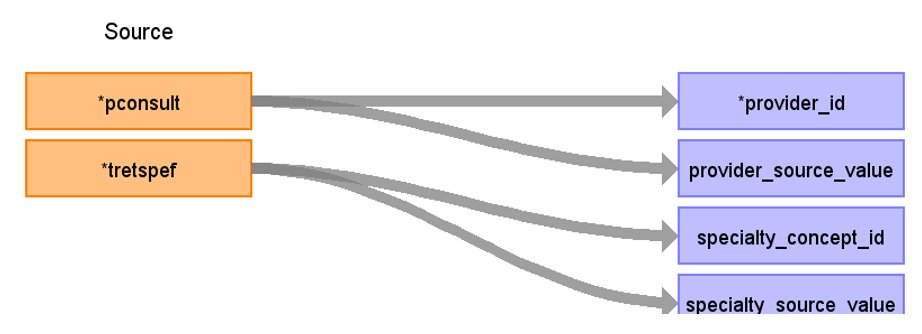

# CDM Table name: PROVIDER (CDM v5.3 / v5.4)

## Reading from hes_episodes

Use the hes_episodes table to populate the provider table. In HES APC, the Pconsult field represents the unique identifier given to the consultant which in this case is representing the provider.  

| Destination Field | Source field | Logic | Comment field |
| --- | --- | :---: | --- |
| provider_id | pconsult | Autogenerate |  |
| provider_name |  |  |  |
| npi |  |  |  |
| dea |  |  |  |
| specialty_concept_id | tretspef | 	If tretspef is not null then concept_id (tretspef) else 0, domain_id='provider' and Vocabulary_id='HES Specialty' and standard_concept='s' | Mainspef are not unique per consultant, so better to record pairs of (consultatnt,soecialty) to be used across the episodes |
| care_site_id | | | |
| year_of_birth |  |  |  |
| gender_concept_id |  | |  |
| provider_source_value | pconsult |  |  |
| specialty_source_value | tretspef | | |
| specialty_source_concept_id |  |  | |
| gender_source_value | | |  |
| gender_source_concept_id |  |  | |
