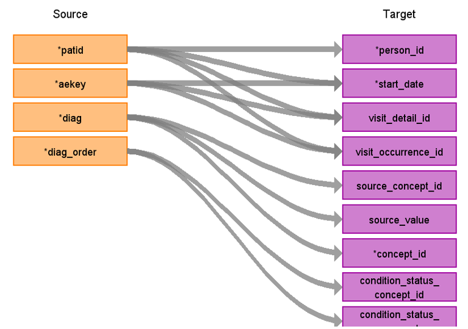

# CDM Table name: stem_table (CDM v5.3 / v5.4)

The stem_table is a staging area where HES A&E source codes like Read codes will first be mapped to concept_ids.

**Reading from hes_diagnosis_epi**

**Figure.1**

|**Destination Field** |**Source field**|**Logic**|**Comment field**|
| --- | 
| id||Removed for performance reasons||
| domain_id | NULL | | |
| person_id | patid| Use patid to lookup Person_id in the  Person table| |
| visit_occurrence_id |visit_detail.visit_occurrence_id| Lookup the visit_occurrence_id of the diagnosis record in the visit_detail table where visit_detail.person_id = hesae_diagnosis.patid AND visit_detail.Visit_detail_source_value = hesae_diagnosis.aekey | |
| visit_detail_id|visit_detail.visit_detail_id| Lookup the visit_detail_id of the diagnosis record in the visit_detail table where visit_detail.person_id = hesae_diagnosis.patid AND visit_detail.Visit_detail_source_value = hesae_diagnosis.aekey | |
| provider_id | NULL| | |
| start_datetime | hesae_attendance.arrivaldate | Lookup the arrivaldate in the hesae_attendance table using the following filters: Where hesae_attendance.patid = hesae_diagnosis.patid AND hesae_attendance.aekeay = hesae_diagnosis.aekey | |
| concept_id | diag | Lookup the hesae_diagnosis.diag in the medicaldictionary and source_to_standard_vocab_map tables, if there are Read codes and ICD10 codes mapped, then get the source_concept_id WHERE Target_standard_concept = ‘S’ and target_invalid_reason is NULL. | |
| source_value| diag | When doing this you will need to Transform the hesae_diagnosis.diag into standard format that matchs the concept source_code.  ||
| source_concept_id | diag | Use the hesae_diagnosis.diag to link to the medicaldictionary table to find the read codes. And use the hesae_diagnosis.diag to link to the SOURCE_TO_STANDARD_VOCAB_MAP table to find the ICD10 code source_concept_id with the following filters:  Where source_vocabulary_id = ‘Read’ or ‘ICD10’ or ‘HESAE_DIAG_STCM’| |
| type_concept_id |  | 32829 ||
| operator_concept_id |NULL | | |
| unit_concept_id |NULL  | | |
| unit_source_value |NULL | | |
| start_date | hesae_attendance.arrivaldate | Lookup the arrivaldate in the hesae_attendance table using the following filters: Where hesae_attendance.patid = hesae_diagnosis.patid AND hesae_attendance.aekeay = hesae_diagnosis.aekey | |
| end_date | hesae_attendance.arrivaldate | Lookup the arrivaldate in the hesae_attendance table using the following filters: Where hesae_attendance.patid = hesae_diagnosis.patid AND hesae_attendance.aekeay = hesae_diagnosis.aekey | |
| range_high | NULL | | |
| range_low |NULL | | |
| value_as_number | NULL| | |
| value_as_string |NULL | | |
| value_as_concept_id |NULL | | |
| value_source_value |NULL | | |
| end_datetime | hesae_attendance.arrivaldate | Lookup the arrivaldate in the hesae_attendance table using the following filters: Where hesae_attendance.patid = hesae_diagnosis.patid AND hesae_attendance.aekeay = hesae_diagnosis.aekey | |
| verbatim_end_date | NULL| | | 
| days_supply |NULL | | |
| dose_unit_source_value |NULL | | |
| lot_number | NULL| | |
| modifier_concept_id |NULL  | | |
| modifier_source_value |NULL | | |
| quantity | NULL| | |
| refills |NULL | | |
| route_concept_id |NULL | | |
| route_source_value | NULL| | |
| sig | NULL | | |
| stop_reason |NULL | | |
| unique_device_id |NULL | | |
| anatomic_site_concept_id |NULL | | |
| disease_status_concept_id |NULL  | | |
| specimen_source_id |NULL| | |
| anatomic_site_source_value |NULL | | |
| disease_status_source_value | NULL| | |
| condition_status_concept_id | diag_order | 32902 if diag_order = 1,32908 if diag_order > 1 ||
| condition_status_source_value | diag_order | | |