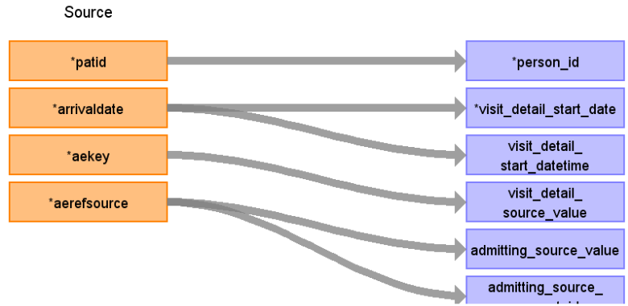

# CDM Table name: VISIT_DETAIL (CDM v5.3)

## Reading from hesae_attendance.

**Reading from hesae_attendance to Visit_Detail CDM v5.3 table:**

**Figure.1**

| Destination Field | Source field | Logic | Comment field |
| --- | --- | --- | --- |
| visit_detail_id |  |  nextval('public.sequence_vd') AS visit_detail_id | Autogenerate|
| person_id | patid |  |  |
| visit_detail_concept_id |  | 9203 = "Emergency Room Visit"  | |
| visit_detail_start_date | arrivaldate | |  |
| visit_detail_start_datetime | arrivaldate | |  |
| visit_detail_end_date | arrivaldate | | |
| visit_detail_end_datetime | arrivaldate | | |
| visit_detail_type_concept_id |  | 32818 = "EHR administration record” |  |
| provider_id |NULL |  | |
| care_site_id |NULL |  |  |
| visit_detail_source_value | aekey | | This will allow us to retrieve visit_detail_id using patid. |
| visit_detail_source_concept_id | NULL |  | |
| admitting_source_concept_id | aerefsource | use aerefsource to retrieve the target_concept_id from source_to_standard_vocab_map by doing a LEFT JOIN to source_to_standard_vocab_map as t1 on CAST(t1.source_code AS INTEGER) = hesae_attendance.aerefsource AND t1.source_vocabulary_id = “HESAE_REFSOURCE_STCM”. |  |
| admitting_source_value | aerefsource | use aerefsource to retrieve the source_code_description from source_to_standard_vocab_map by doing a LEFT JOIN to source_to_standard_vocab_map as t1 on CAST(t1.source_code AS INTEGER) = hesae_attendance.aerefsource AND t1.source_vocabulary_id = “HESAE_REFSOURCE_STCM”. |  |
| discharge_to_concept_id |NULL |  |  |
| discharge_to_source_value |  NULL|  |  |
| preceding_visit_detail_id |  |  | Use patid + aekey where to get the preceding visit_detail_id if any.|
| visit_detail_parent_id | NULL |  |  |
| visit_occurrence_id |  |  | Use aekey to retrieve visit_occurrence_id from visit_occurrence.visit_source_value |