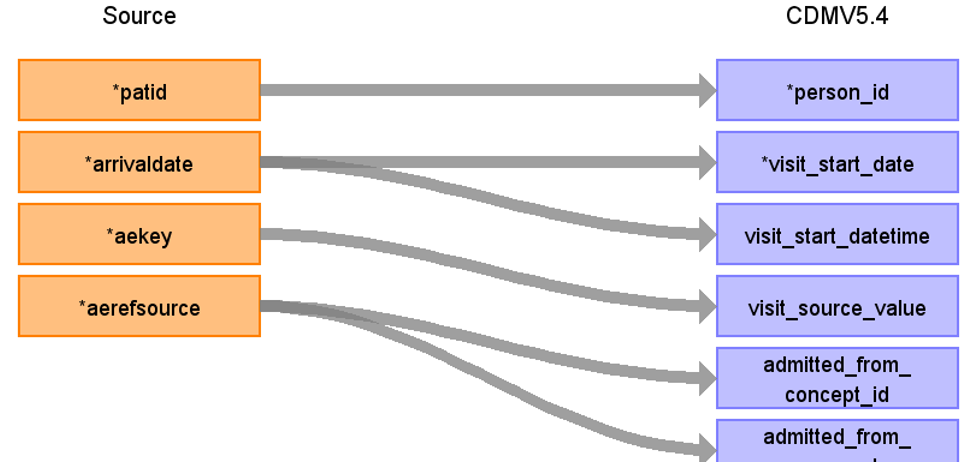

# CDM Table name: VISIT_OCCURRENCE (CDM v5.4)

**Reading from hesae_attendance to Visit_Occurrence CDM v5.4 table:**

**Figure.1**

| Destination Field | Source field | Logic | Comment field |
| --- | --- | --- | --- |
| visit_occurrence_id |  |  nextval('public.sequence_vo') AS visit_occurrence_id | Autogenerate| 
| person_id | patid |  |  |
| visit_concept_id |  | 9203 = "Emergency Room Visit" |  |
| visit_start_date | arrivaldate | MIN(arrivaldate) |   |
| visit_start_datetime | arrivaldate | MIN(arrivaldate) |  |
| visit_end_date | arrivaldate| MAX(arrivaldate) | |
| visit_end_datetime | arrivaldate | MAX(arrivaldate) | |
| visit_type_concept_id |  | 32818 = "EHR administration record” |  |
| provider_id | NULL | |  |
| care_site_id | NULL | |  |
| visit_source_value | aekey | | This will allow us to retrieve Visit_occurrence_id.  |
| visit_source_concept_id | NULL |  |  |
| admitted_from_concept_id | aerefsource | use aerefsource to retrieve the target_concept_id from source_to_standard_vocab_map by doing a LEFT JOIN to source_to_standard_vocab_map as t1 on CAST(t1.source_code AS INTEGER) = hesae_attendance.aerefsource AND t1.source_vocabulary_id = “HESAE_REFSOURCE_STCM”. |  |
| admitted_from_source_value | aerefsource | use aerefsource to retrieve the source_code_description from source_to_standard_vocab_map by doing a LEFT JOIN to source_to_standard_vocab_map as t1 on CAST(t1.source_code AS INTEGER) = hesae_attendance.aerefsource AND t1.source_vocabulary_id = “HESAE_REFSOURCE_STCM”. |  |
| discharged_to_concept_id | NULL |  | |
| discharged_to_source_value | NULL |  |  |
| preceding_visit_occurrence_id |  | | Using person_id, look up the attendances that occurred prior to this and put the visit_occurrence_id here.  |