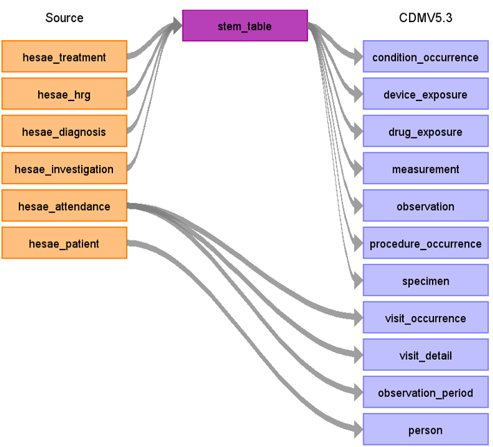

# Hospital Episode Statistics (HES) Accident & Emergency ETL Documentation

These materials are meant to serve as documentation and reference for how the [HES A&E](https://cprd.com/sites/default/files/2022-02/Documentation_HES_AE_set21.pdf) dataset was converted to the [OMOP Common Data Model (CDM)](https://ohdsi.github.io/CommonDataModel/).

The image below (Figure.1) shows a high-level diagram of how the native tables in the HES AE database were mapped to the OMOP CDM. The main HES AE tables converted include: (hesae_treatment, hesae_hrg, hesae_diagnosis, hesae_investigation, hesae_attendance and hesae_patient).

*HES A&E source Data Mapping for CDM v5.3 & CDM v5.4*

**Figure.1**

## Change log

### 12-Dec-2023
- Creation of documentation