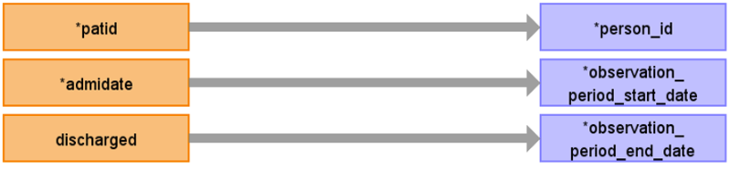

# CDM Table name: OBSERVATION_PERIOD (CDM v5.3 / v5.4)

## Reading from hes_hospital,hes_episodes.
Use the hes_hospital & hes_episodes tables to populate the observation_period table.

**Figure.1**

| Destination Field | Source field | Logic | Comment field |
| --- | --- | :---: | --- |
| observation_period_id |  | nextval('public.observation_period_seq') AS observation_period_id |  Autogenerate|
| person_id | patid| | |
| observation_period_start_date | admidate,hes_episodes.epistart | Retrieve the earliest date among those dates like this: LEAST(MIN(admidate), MIN(hes_episodes.epistart)) AS min_date| |
| observation_period_end_date | discharged,hes_episodes.epiend | Retrieve the latest date among the date fields like this: GREATEST(MAX(discharged), MAX(hes_episodes.epiend)) AS max_date | |
| period_type_concept_id | | 32880 | |