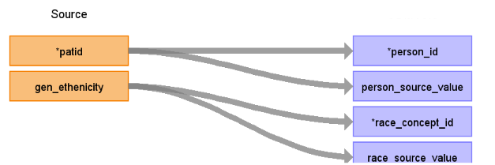

# CDM Table name: PERSON (CDM v5.3 / v5.4)

## Reading from hes_patient

The patients mapped to the CDM from HES APC in this instance were restricted to those with a match_rank equal to one or two and had an entry in the hospital visit table, while the others were discarded.

**Figure.1**

| Destination Field | Source field | Logic | Comment field |
| --- | --- | :---: | --- |
| person_id | patid |  	|  If a patient has no entry in source_hesapc.hes_hospital, disregard it.Data like gender, year_of_birth, location_id, Care_site_id comes from AURUM/GOLD as the data are linked to them.|
| gender_concept_id | 0 | | |
| year_of_birth | 0 | | |
| month_of_birth |NULL |  | |
| day_of_birth | NULL |  |  |
| birth_datetime | NULL |  |  |
| race_concept_id | gen_ethnicity | gen_ethnicity will be mapped to Race Concept_id by using CPRD_ETHNIC_STCM | |
| ethnicity_concept_id | 0 |  |   |
| location_id | NULL |  |  |
| provider_id | NULL |  |  |
| care_site_id |NULL | |  |
| person_source_value | patid |  |  |
| gender_source_value | NULL|  | |
| gender_source_concept_id |NULL  |  |  |
| race_source_value | gen_ethnicity| | |
| race_source_concept_id | NULL | |
| ethnicity_source_value | NULL |  |  | 
| ethnicity_source_concept_id | 0 |  |  |

## Change log

### 12-Nov-2023
- Creation of documentation