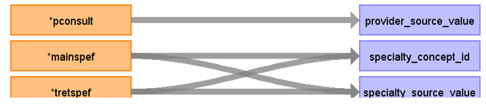

# CDM Table name: PROVIDER (CDM v5.3 / v5.4)

## Reading from hes_episodes

Use the hes_episodes table to populate the provider table.  

**Figure.1**

| Destination Field | Source field | Logic | Comment field |
| --- | --- | :---: | --- |
| provider_id |  |  | Autogenerate|
| provider_name | NULL |  |  |
| specialty_concept_id | tretspef, mainspef | In the absence of a provider_id, we have created dummy provider_ids, each associated with a different specialty, using the first available value from either tretspef or mainspef.|  |
| care_site_id |NULL | | |
| year_of_birth | NULL |  |  |
| gender_concept_id | NULL | |  |
| provider_source_value | pconsult |  |  |
| specialty_source_value | tretspef, mainspef | Use the first available value from either tretspef or mainspef.|  |
| specialty_source_concept_id | NULL |  | |
| gender_source_value | NULL| |  |
| gender_source_concept_id | NULL |  | |