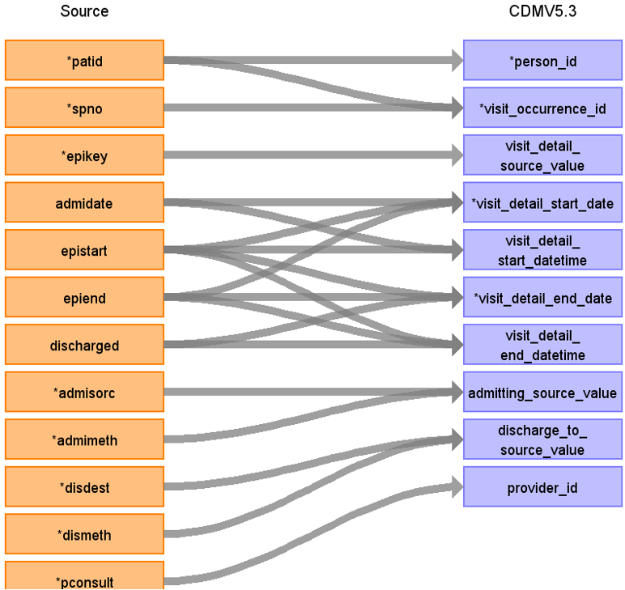
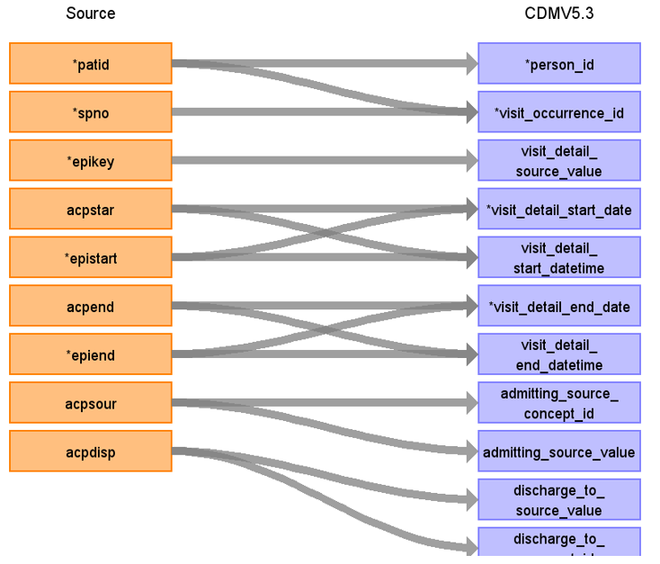
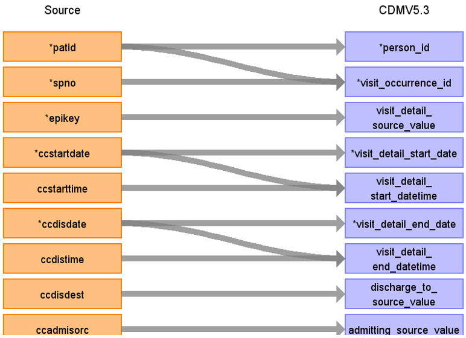

# CDM Table name: Visit_detail (CDM v5.3)

## Reading from hes_episodes to Visit_Detail CDM v5.3 table:

**Figure.1**

| Destination Field | Source field | Logic | Comment field |
| --- | --- | :---: | --- |
| visit_detail_id |  |  nextval('public.sequence_vd') AS visit_detail_id | Autogenerate|
| person_id | patid |  |  |
| visit_detail_concept_id |  | 9201 = Inpatient visit |  |
| visit_detail_start_date | epistart | COALESCE(epistart, admidate, epiend)|   |
| visit_detail_start_datetime | epistart | COALESCE(epistart, admidate, epiend)|  |
| visit_detail_end_date | epiend | COALESCE(epiend, discharged, epistart)|  |
| visit_detail_end_datetime | epiend | COALESCE(epiend, discharged, epistart) |  |
| visit_detail_type_concept_id |  | 32818 = "EHR administration record” |  |
| provider_id | pconsult | use hes_episode.pconsult inorder to retrieve the provider_id from provider by LEFT JOINING provider as t1 on  t1.provider_source_value = hes_episode.pconsult. | |
| care_site_id |NULL |  |  |
| visit_detail_source_value | epikey | | This will allow us to retrieve visit_detail_id using patid. |
| visit_detail_source_concept_id | NULL|  | |
| admitting_source_concept_id | admimeth | use admimeth to retrieve the target_concept_id from source_to_standard_vocab_map by doing a LEFT JOIN to source_to_standard_vocab_map as t1 on hes_hospital.admimeth = t1.source_code AND t1.source_vocabulary_id = “HESAPC_ADMIMETH_STCM”. |  |
| admitting_source_value | admimeth | use admimeth to retrieve the source_code_description from source_to_standard_vocab_map by doing a LEFT JOIN to source_to_standard_vocab_map as t1 on hes_hospital.admimeth = t1.source_code AND t1.source_vocabulary_id = “HESAPC_ADMIMETH_STCM”.| |
| discharge_to_concept_id | dismeth | use dismeth to retrieve the target_concept_id from source_to_standard_vocab_map by doing a LEFT JOIN to source_to_standard_vocab_map as t1 on hes_hospital.dismeth = t1.source_code AND t1.source_vocabulary_id = “HESAPC_DISMETH_STCM”. | |
| discharge_to_source_value | dismeth | use dismeth to retrieve the source_code_description from source_to_standard_vocab_map by doing a LEFT JOIN to source_to_standard_vocab_map as t1 on hes_hospital.dismeth = t1.source_code AND t1.source_vocabulary_id = “HESAPC_DISMETH_STCM”. |  |
| preceding_visit_detail_id | eorder | If eorder = 1 then 0 else check for preceding_visit_detail_id by using eorder for this patient using patid+epikey+spno. |  |
| visit_detail_parent_id | NULL  |  |  |
| visit_occurrence_id |  |  | Use spno to retrieve visit_occurrence_id from visit_occurrence.visit_source_value |

## Reading from hes_acp to Visit_Detail CDM v5.3 table:

**Figure.2**

| Destination Field | Source field | Logic | Comment field |
| --- | --- | :---: | --- |
| visit_detail_id |  |  nextval('public.sequence_vd') AS visit_detail_id | Autogenerate|
| person_id | patid |  |  |
| visit_detail_concept_id |  | 32037 = Intensive care |  |
| visit_detail_start_date | acpstart,epistart | COALESCE(acpstar,epistart) | |
| visit_detail_start_datetime | acpstar, epistart | COALESCE(acpstar,epistart) |   |
| visit_detail_end_date | acpend, epiend | COALESCE(acpstar,epistart) |  |
| visit_detail_end_datetime | acpend, epiend | COALESCE(acpend,epiend) |   |
| visit_detail_type_concept_id |  | 32818 = "EHR administration record” |  |
| provider_id | hes_episodes.pconsult |  | Use patid+epikey to get it (only if efficient and provider populated) |
| care_site_id |NULL |  |  |
| visit_detail_source_value | epikey | | This will allow to retrieve visit_details_id using patid If acpn = 1 then 0 else use acpn with patid+epikey and visit_detail_source_value = “Augmented care period (ACP)” to find the preceding_visit_detail_id  |
| visit_detail_source_concept_id | NULL|  | |
| admitting_source_concept_id | acpsour | use acpsour to retrieve the target_concept_id from source_to_concept_map by doing a LEFT JOIN to source_to_concept_map as t1 on t1.source_code = hes_apc.acpsour AND t1.source_vocabulary_id = “HESAPC_ACPSOUR_STCM”. |  |
| admitting_source_value | acpsour | use acpsour to retrieve the source_code_description from source_to_concept_map by doing a LEFT JOIN to source_to_concept_map as t1 on t1.source_code = hes_apc.acpsour AND t1.source_vocabulary_id = “HESAPC_ACPSOUR_STCM”. |  |
| discharge_to_concept_id | acpdisp | use acpdisp to retrieve the target_concept_id from source_to_concept_map by doing a LEFT JOIN to source_to_concept_map as t1 on t1.source_code = hes_apc.acpdisp AND t1.source_vocabulary_id = “HESAPC_ACPDISP_STCM”. |  |
| discharge_to_source_value | acpdisp | use acpdisp to retrieve the source_code_description from source_to_concept_map by doing a LEFT JOIN to source_to_concept_map as t1 on t1.source_code = hes_apc.acpdisp AND t1.source_vocabulary_id = “HESAPC_ACPDISP_STCM”. |  |
| preceding_visit_detail_id | | If acpn = 1 then 0 else use acpn with patid+epikey and visit_detail_source_value = “Augmented care period (ACP)” to find the preceding_visit_detail_id |  |
| visit_detail_parent_id |  |  | Use patid + epikey where visit_detail_source_value= “Visit episode” to get the visit_detail_parent_id  |
| visit_occurrence_id |  |  | Use spno to retrieve visit_occurrence_id from visit_occurrence.visit_source_value   |

## Reading from hes_ccare to Visit_Detail CDM v5.3 table:

**Figure.3**

| Destination Field | Source field | Logic | Comment field |
| --- | --- | :---: | --- |
| visit_detail_id |  |  nextval('public.sequence_vd') AS visit_detail_id | Autogenerate|
| person_id | patid |  |  |
| visit_detail_concept_id |  | 32037 = Intensive care |  |
| visit_detail_start_date | ccstartdate | | |
| visit_detail_start_datetime | ccstartdate | use ccstartdate if ccstarttime is null else ccstartdate::timestamp + ccstarttime::time as visit_detail_start_datetime. | |
| visit_detail_end_date | ccdisdate | | |
| visit_detail_end_datetime | ccdisdate | use ccdisdate if ccdistime is null else ccdisdate::timestamp + ccdistime::time as visit_detail_end_datetime.  |  |
| visit_detail_type_concept_id |  | 32818 = "EHR administration record” |  |
| provider_id | hes_episodes.pconsult |  | Use patid+epikey to get it (only if efficient and provider populated) |
| care_site_id |NULL |  |  |
| visit_detail_source_value | epikey | | This will allow to retrieve visit_details_id set to 0 at the end |
| visit_detail_source_concept_id | NULL|  | |
| admitting_source_concept_id | ccadmisorc | use ccadmisorc to retrieve the target_concept_id from source_to_concept_map by doing a LEFT JOIN to source_to_concept_map as t1 on t1.source_code = hes_ccare.ccadmisorc AND t1.source_vocabulary_id = “HESAPC_ADMISORC_STCM”. | |
| admitting_source_value | ccadmisorc | use ccadmisorc to retrieve the source_code_description from source_to_concept_map by doing a LEFT JOIN to source_to_concept_map as t1 on t1.source_code = hes_ccare.ccadmisorc AND t1.source_vocabulary_id = “HESAPC_ADMISORC_STCM”. | |
| discharge_to_concept_id | ccdisdest | use ccdisdest to retrieve the target_concept_id from source_to_concept_map by doing a LEFT JOIN to source_to_concept_map as t1 on t1.source_code = hes_ccare.ccdisdest AND t1.source_vocabulary_id = “HESAPC_DISDEST_STCM”. |  |
| discharge_to_source_value | ccdisdest | use ccdisdest to retrieve the source_code_description from source_to_concept_map by doing a LEFT JOIN to source_to_concept_map as t1 on t1.source_code = hes_ccare.ccdisdest AND t1.source_vocabulary_id = “HESAPC_DISDEST_STCM”. |  |
| preceding_visit_detail_id | | If eorder = 1 then 0 else use eorder with patid+epikey to find the preceding_visit_detail_id |  |
| visit_detail_parent_id |  |  | Use patid + epikey where visit_detail_source_value= “Visit episode” to get the visit_detail_parent_id  |
| visit_occurrence_id |  |  | Use spno to retrieve visit_occurrence_id from visit_occurrence.visit_source_value   |