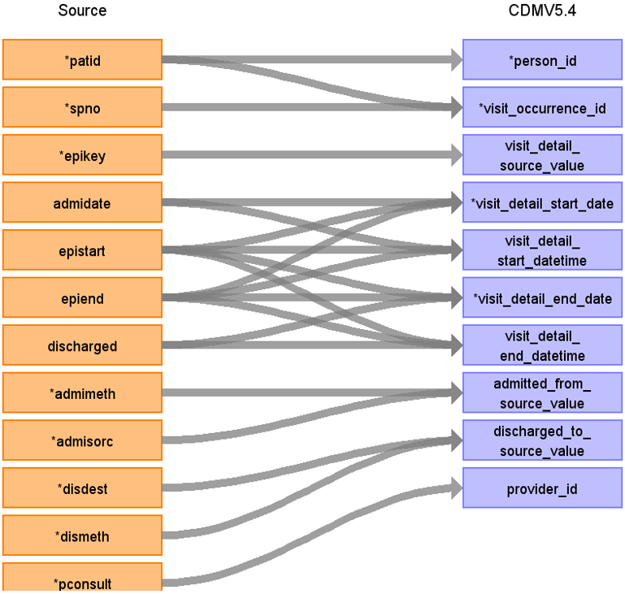
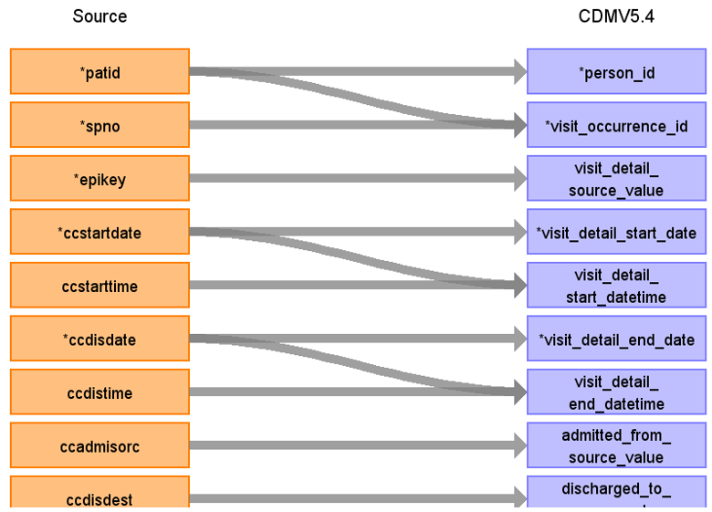

# CDM Table name: Visit_detail (CDM v5.4)

## Reading from hes_episodes to Visit_Detail:

**Figure.1**

| Destination Field | Source field | Logic | Comment field |
| --- | --- | :---: | --- |
| visit_detail_id |  |  | Autogenerate|
| person_id | patid |  |  |
| visit_detail_concept_id |  | [9201- Inpatient visit](https://athena.ohdsi.org/search-terms/terms/9201)|  |
| visit_detail_start_date | epistart, admidate, epiend | use the minimum of the first not null of (epistart,admidate,epiend )|   |
| visit_detail_start_datetime | epistart, admidate, epiend | |  |
| visit_detail_end_date | epiend, discharged, epistart | use the first not null of (epiend,discharged,epistart ) |   |
| visit_detail_end_datetime | epiend, discharged, epistart | |   |
| visit_detail_type_concept_id |  | [32818- EHR administration record](https://athena.ohdsi.org/search-terms/terms/32818)| |
| provider_id | pconsult | use pconsult to retrieve the provider_id from the provider table. | |
| care_site_id |NULL |  |  |
| visit_detail_source_value | epikey | | |
| visit_detail_source_concept_id |NULL  |  |  |
| admitted_from_concept_id | NULL  | |  |
| admitted_from_source_value | admisorc, admimeth | concatenate admisorc and admimeth values into one text field separated by a slash|  |
| discharged_to_concept_id | NULL  | |  |
| discharged_to_source_value | disdest, dismeth | concatenate disdest and dismeth values into one text field separated by a slash.|  |
| preceding_visit_detail_id | | latest visit_detail_id before this one, for the patient if available |  |
| parent_visit_detail_id | NULL |  |  |
| visit_occurrence_id | patid, spno | Use patid & spno to retrieve visit_occurrence_id from visit_occurrence table. |  |

<!-- ## Reading from hes_acp to Visit_Detail:
--

--**Figure.2**

--| Destination Field | Source field | Logic | Comment field |
--| --- | --- | :---: | --- |
| visit_detail_id |  |   | Autogenerate|
| person_id | patid |  |  |
| visit_detail_concept_id |  | [32037- Intensive care](https://athena.ohdsi.org/search-terms/terms/32037)|  |
| visit_detail_start_date | acpstar, epistart | use the minimum of the first not null of (acpstar, epistart ) |  |
| visit_detail_start_datetime | acpstar, epistart |  |   |
| visit_detail_end_date | acpend, epiend | use the first not null of (acpend, epiend ) |  |
| visit_detail_end_datetime | acpend, epiend | |  |
| visit_detail_type_concept_id |  | [32818- EHR administration record](https://athena.ohdsi.org/search-terms/terms/32818)|   |
| provider_id | hes_episodes.pconsult | use hes_episodes.pconsult to retrieve the provider_id from the provider table. |  |
| care_site_id |NULL |  |  |
| visit_detail_source_value | epikey | | |
| visit_detail_source_concept_id | NULL |  |  |
| admitted_from_concept_id | acpsour | use HESAPC_ACPSOUR_STCM | |
| admitted_from_source_value | acpsour | |  |
| discharged_to_concept_id | acpdisp | use HESAPC_ACPDISP_STCM |  |
| discharged_to_source_value  | acpdisp | |  |
| preceding_visit_detail_id | | latest visit_detail_id before this one, for the patient if available |  |
| parent_visit_detail_id | NULL |  |  |
| visit_occurrence_id | patid, spno | Use patid & spno to retrieve visit_occurrence_id from visit_occurrence table. |  |

-->

## Reading from hes_ccare to Visit_Detail CDM v5.4 table:

**Figure.2**

| Destination Field | Source field | Logic | Comment field |
| --- | --- | :---: | --- |
| visit_detail_id |  |  | Autogenerate|
| person_id | patid |  |  |
| visit_detail_concept_id |  | [32037- Intensive care](https://athena.ohdsi.org/search-terms/terms/32037)|  |
| visit_detail_start_date | ccstartdate | | |
| visit_detail_start_datetime | ccstartdate, ccstarttime | use ccstartdate if ccstarttime is null else ccstartdate::timestamp + ccstarttime::time as visit_detail_start_datetime. | |
| visit_detail_end_date | ccdisdate | | |
| visit_detail_end_datetime | ccdisdate, ccdistime | use ccdisdate if ccdistime is null else ccdisdate::timestamp + ccdistime::time as visit_detail_end_datetime.  |  |
| visit_detail_type_concept_id |  | [32818- EHR administration record](https://athena.ohdsi.org/search-terms/terms/32818)|     |
| provider_id | hes_episodes.pconsult | use hes_episodes.pconsult to retrieve the provider_id from the provider table. |  |
| care_site_id | NULL|  |  |
| visit_detail_source_value | epikey | | |
| visit_detail_source_concept_id | NULL |  |  |
| admitted_from_concept_id | NULL  | |  |
| admitted_from_source_value | ccadmisorc | |  |
| discharged_to_concept_id | NULL  | |  |
| discharged_to_source_value | ccdisdest |  |  |
| preceding_visit_detail_id | | latest visit_detail_id before this one, for the patient if available |  |
| parent_visit_detail_id | NULL |  |   |
| visit_occurrence_id | patid, spno | Use patid & spno to retrieve visit_occurrence_id from visit_occurrence table.   |