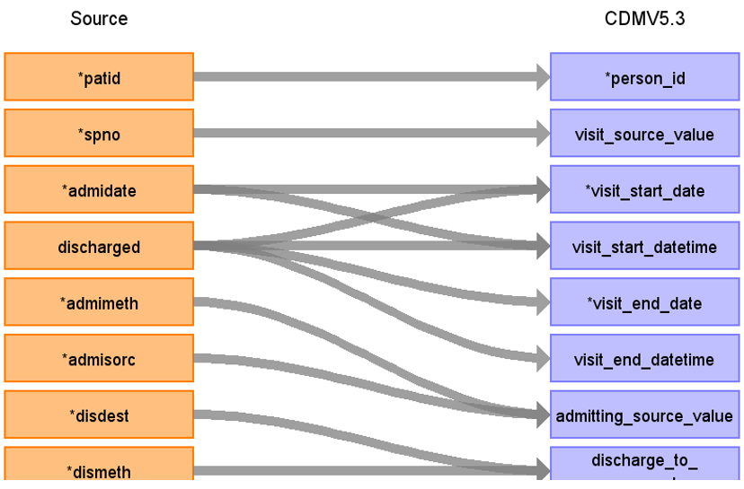

# CDM Table name: Visit_Occurrence (CDM v5.3)

## Reading from hes_hospital to Visit_Occurrence CDM v5.3 table:

**Figure.1**

| Destination Field | Source field | Logic | Comment field |
| --- | --- | :---: | --- |
| visit_occurrence_id |  |   | Autogenerate | 
| person_id | patid |  |  |
| visit_concept_id |  | [9201- Inpatient visit](https://athena.ohdsi.org/search-terms/terms/9201)|  |
| visit_start_date | admidate epistart discharged | use the minimum of the first not null of (admidate,epistart,discharged) within the hospital spell|    |
| visit_start_datetime | admidate epistart discharged | |  |
| visit_end_date | discharged, epiend, epistart | use the first not null value of either discharged and the maximum of (epiend, epistart) within the hospital spell|  |
| visit_end_datetime | discharged, epiend, epistart | | |
| visit_type_concept_id |  |  [32818- EHR administration record](https://athena.ohdsi.org/search-terms/terms/32818)| |
| provider_id |NULL | |  |
| care_site_id | NULL| |  |
| visit_source_value | spno |  | |
| visit_source_concept_id |NULL  |  |  |
| admitting_source_concept_id | NULL  | |  |
| admitting_source_value | admisorc, admimeth | concatenate admisorc and admimeth values into one text field separated by a slash|  |
| discharge_to_concept_id | NULL  | |  |
| discharge_to_source_value | disdest, dismeth | concatenate disdest and dismeth values into one text field separated by a slash.|  |
| preceding_visit_occurrence_id |  | latest visit_occurrence_id before this one, for the patient if available |  |