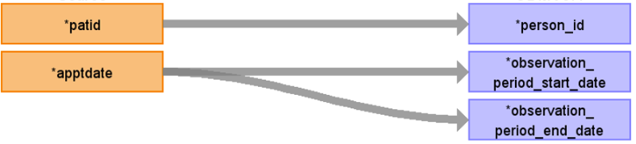

# CDM Table name: OBSERVATION_PERIOD (CDM v5.3 / v5.4)

## Reading from hesop_appointment.
Use the hesop_appointment table to populate the observation_period table.

**Figure.1**

| Destination Field | Source field | Logic | Comment field |
| --- | --- | :---: | --- |
| observation_period_id |  | nextval('public.observation_period_seq') AS observation_period_id |  Autogenerate|
| person_id | patid| | |
| observation_period_start_date | apptdate| Retrieve the earliest date among those dates like this: LEAST(MIN(apptdate),linkage_coverag.end) AS min_date| |
| observation_period_end_date | apptdate | Retrieve the latest date among the date fields like this: GREATEST(MIN(apptdate), linkage_coverag.start) AS max_date | |
| period_type_concept_id | | 32880 | |