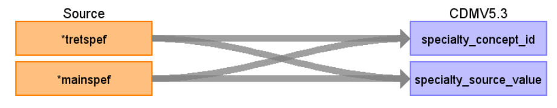

# CDM Table name: PROVIDER (CDM v5.3 / v5.4)

## Reading from hesop_clinical

Use the hesop_clinical table to populate the provider table. 

**Figure.1**

| Destination Field | Source field | Logic | Comment field |
| --- | --- | :---: | --- |
| provider_id | | nextval('public.sequence_pro') AS provider_id| Autogenerate|
| provider_name | NULL |  |  |
| npi | NULL |  |  |
| dea |NULL  |  |  |
| specialty_concept_id | tretspef, mainspef | specialty_concept_id will be mapped to standard SNOMED Concept_id by using tretspef if tretspef<>‘&’ else mainspef as Speciality FROM hesop_clinical WHERE (tretspef <> ‘&’ OR mainspef <> ‘&’) to retrieve the target_concept_id from source_to_concept_map as t1 where t1.source_code = hesop_clinical.specialty AND source_vocabulary_id = “HES_SPEC_STCM”.||
| care_site_id | NULL| | |
| year_of_birth | NULL |  |  |
| gender_concept_id | NULL | |  |
| provider_source_value | NULL |  | |
| specialty_source_value | tretspef, mainspef | specialty_source_value will be mapped to standard SNOMED Concept_id by using tretspef if tretspef<>‘&’ else mainspef as speciality FROM hesop_clinical WHERE (tretspef <> ‘&’ OR mainspef <> ‘&’) to retrieve the source_code_description from source_to_concept_map as t1 where t1.source_code = hesop_clinical.specialty AND source_vocabulary_id = “HES_SPEC_STCM”.||
| specialty_source_concept_id |NULL  |  | |
| gender_source_value | NULL| |  |
| gender_source_concept_id | NULL |  | |