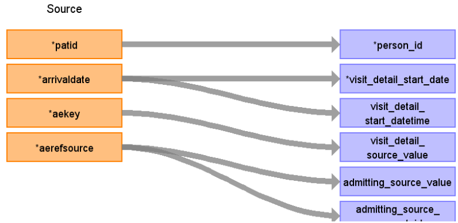

# CDM Table name: VISIT_DETAIL (CDM v5.3 / v5.4)

## Reading from hesae_attendance.

**Reading from hesae_attendance to Visit_Detail CDM v5.3 / v5.4 table:**

**Figure.1**

| Destination Field | Source field | Logic | Comment field |
| --- | --- | --- | --- |
| visit_detail_id |  |  | Autogenerate: if table is empty, starts from MAX(public.visit_detail) + 1|
| person_id | patid |  |  |
| visit_detail_concept_id |  |  | 9201 = Inpatient visit |
| visit_detail_start_date | arrivaldate | |  |
| visit_detail_start_datetime | arrivaldate | |  |
| visit_detail_end_date |  | | Arrivaldate+depdur may allow us to retrieve the visit_end_date (To be investigated later)|
| visit_detail_end_datetime | | |  Arrivaldate+depdur may allow us to retrieve the visit_end_date (To be investigated later)|
| visit_detail_type_concept_id |  |  | 32818 = "EHR administration record” |
| provider_id |NULL |  | |
| care_site_id |NULL |  |  |
| visit_detail_source_value | aekey | | This will allow us to retrieve visit_detail_id using patid. |
| visit_detail_source_concept_id |  |  | 32828 |
| admitting_source_concept_id | aerefsource |  | Definition to be added instead of number |
| admitting_source_value | aerefsource |  | Check for OMOP codes from aerefsource |
| discharge_to_concept_id |NULL |  |  |
| discharge_to_source_value |  NULL|  |  |
| preceding_visit_detail_id |  |  | Use patid + aekey where to get the preceding visit_detail_id if any.|
| visit_detail_parent_id | NULL |  |  |
| visit_occurrence_id |  |  | Use aekey to retrieve visit_occurrence_id from visit_occurrence.visit_source_value |