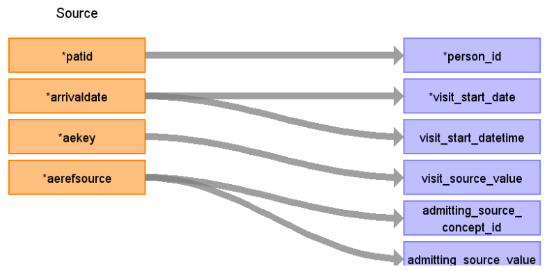

# CDM Table name: VISIT_OCCURRENCE (CDM v5.3 / v5.4)

**Reading from hesae_attendance to Visit_Occurrence CDM v5.3/ v5.4 table:**

**Figure.1**

| Destination Field | Source field | Logic | Comment field |
| --- | --- | --- | --- |
| visit_occurrence_id |  |  | Autogenerate: if table is empty, start from MAX(public.visit_occurrence)+1  |
| person_id | patid |  |  |
| visit_concept_id |  |  | 9201 = Inpatient visit |
| visit_start_date | arrivaldate | | Arrival date will be mapped to visit_start_date  |
| visit_start_datetime | | |Arrival date will be mapped to visit_start_date  |
| visit_end_date | rrivaldate| | Arrivaldate+depdur may allow us to retrieve the visit_end_date (To be investigated later)|
| visit_end_datetime | | | Arrivaldate+depdur may allow us to retrieve the visit_end_date (To be investigated later) |
| visit_type_concept_id |  |  | 32818 = "EHR administration record” |
| provider_id | | |  |
| care_site_id | | |  |
| visit_source_value | aekey | | This will allow us to retrieve Visit_occurrence_id.  |
| visit_source_concept_id |  |  |  |
| admitting_source_concept_id | aerefsource |  | Check for OMOP codes from aerefsource |
| admitting_source_value | aerefsource |  | Definition to be added instead of number |
| discharge_to_concept_id |  |  | |
| discharge_to_source_value |  |  |  |
| preceding_visit_occurrence_id |  | | Using person_id, look up the attendances that occurred prior to this and put the visit_occurrence_id here.  |