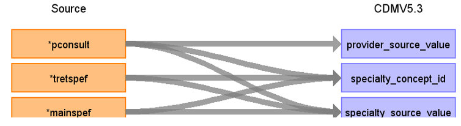

# CDM Table name: PROVIDER (CDM v5.3 / v5.4)

## Reading from hes_episodes

Use the hes_episodes table to populate the provider table.  

**Figure.1**

| Destination Field | Source field | Logic | Comment field |
| --- | --- | :---: | --- |
| provider_id |  | nextval('public.sequence_pro') AS provider_id | A sequence named "sequence_pro" is created in the public schema to uniquely generate "provider_id"s. It initializes by fetching the highest ID from the _max_ids table where "tbl_name" equals "provider". This table, located in the schema to be linked to the target schema, stores the maximum IDs for all CDM tables to help set the starting point for the next ID in a given sequence.|
| provider_name | NULL |  |  |
| npi | NULL |  |  |
| dea | NULL |  |  |
| specialty_concept_id | tretspef,mainspef,pconsult | use tretspef if tretspef<>'&' ELSE mainspef as Speciality FROM hes_episode WHERE pconsult <> '&' AND (tretspef <> '&' OR mainspef <> '&'), inorder to retrieve the target_concept_id from source_to_concept_map by joining to the source_to_concept_map with the following JOIN: LEFT JOIN source_to_concept_map as t2 on hes_episode.specialty = t2.source_code AND t2.source_vocabulary_id = “HES_SPEC_STCM”.|  |
| care_site_id |NULL | | |
| year_of_birth | NULL |  |  |
| gender_concept_id | NULL | |  |
| provider_source_value | pconsult |  |  |
| specialty_source_value | tretspef,mainspef,pconsult | use tretspef if tretspef<>'&' ELSE mainspef as Speciality FROM hes_episode WHERE pconsult <> '&' AND (tretspef <> '&' OR mainspef <> '&'), inorder to retrieve the source_code_description from source_to_concept_map by joining to the source_to_concept_map with the following JOIN: LEFT JOIN source_to_concept_map as t2 on hes_episode.specialty = t2.source_code AND t2.source_vocabulary_id = “HES_SPEC_STCM”.|  |
| specialty_source_concept_id | NULL |  | |
| gender_source_value | NULL| |  |
| gender_source_concept_id | NULL |  | |