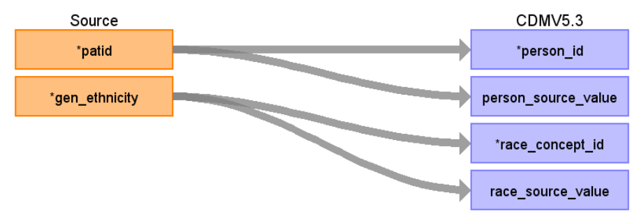

# CDM Table name: PERSON (CDM v5.3 / v5.4)

## Reading from hesop_patient

The patients mapped to the CDM from HES OP in this instance were restricted to those with a match_rank equal to one or two and the others were discarded.

**Figure.1**

| Destination Field | Source field | Logic | Comment field |
| --- | --- | :---: | --- |
| person_id | patid |  	If match_rank >= 3 discard patient (we accept only match_rank = 1 or match_rank = 2)|  Data like gender, year_of_birth, location_id, Care_site_id comes from AURUM/GOLD as the data are linked to them.|
| gender_concept_id | 0 | | |
| year_of_birth | 0 | | |
| month_of_birth | NULL|  | |
| day_of_birth | NULL |  |  |
| birth_datetime |NULL  |  |  |
| race_concept_id | gen_ethnicity | race_concept_id will be mapped to SNOMED Concept_id by using gen_ethnicity in hesop_patient table to retrieve the target_concept_id from source_to_concept_map as t1 where t1.source_code = hesop_patient.gen_ethnicity AND source_vocabulary_id = "CPRD_ETHNIC_STCM".| |
| ethnicity_concept_id | 0 |  |   |
| location_id |NULL  |  |  |
| provider_id | NULL |  |  |
| care_site_id | NULL| |  |
| person_source_value | patid |  |  |
| gender_source_value |NULL |  | |
| gender_source_concept_id | NULL |  |  |
| race_source_value | gen_ethnicity| race_source_value will be mapped to SNOMED Concept_id by using gen_ethnicity in hesop_patient table to retrieve the source_code_description from source_to_concept_map as t1 where t1.source_code = hesop_patient.gen_ethnicity AND source_vocabulary_id = "CPRD_ETHNIC_STCM"| |
| race_source_concept_id | NULL | |
| ethnicity_source_value | NULL |  |  | 
| ethnicity_source_concept_id | 0 |  |  |

