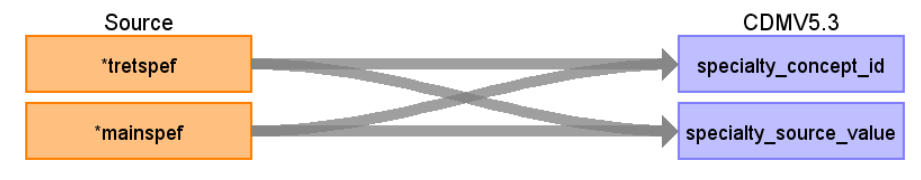

# CDM Table name: PROVIDER (CDM v5.3 / v5.4)

## Reading from hesop_clinical

Use the hesop_clinical table to populate the provider table. 

| Destination Field | Source field | Logic | Comment field |
| --- | --- | :---: | --- |
| provider_id | | | Autogenerate: If table is empty, start from MAX(public.Provider)+1 |
| provider_name | NULL |  |  |
| npi | NULL |  |  |
| dea |NULL  |  |  |
| specialty_concept_id | tretspef, mainspef | If tretspef is not null then tretspef else mainspef|
| care_site_id | NULL| | |
| year_of_birth | NULL |  |  |
| gender_concept_id | NULL | |  |
| provider_source_value | NULL |  | |
| specialty_source_value | tretspef, mainspef | If tretspef is not null then tretspef else mainspef|
| specialty_source_concept_id |NULL  |  | |
| gender_source_value | NULL| |  |
| gender_source_concept_id | NULL |  | |