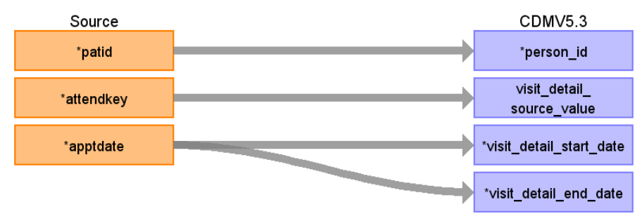

# CDM Table name: VISIT_DETAIL (CDM v5.3)

## Reading from hesop_appointment.

**Reading from hesop_appointment to Visit_Detail CDM v5.3 table:**

**Figure.1**

| Destination Field | Source field | Logic | Comment field |
| --- | --- | --- | --- |
| visit_detail_id |  | nextval('public.sequence_vd') AS visit_detail_id |  	Autogenerate |
| person_id | patid |  | |
| visit_detail_concept_id |  | 9202 = Outpatient visit |  |
| visit_detail_start_date | apptdate | |  |
| visit_detail_start_datetime | apptdate | |  |
| visit_detail_end_date | apptdate | |  |
| visit_detail_end_datetime | apptdate | | |
| visit_detail_type_concept_id |  | 32818 = "EHR administration record” |  |
| provider_id | NULL|  | |
| care_site_id | NULL|  |  |
| visit_detail_source_value | attendkey | | This will allow us to retrieve visit_detail_id using attendkey. |
| visit_detail_source_concept_id |NULL  |  | |
| admitting_source_concept_id |NULL |  |  |
| admitting_source_value | NULL|  |  |
| discharge_to_concept_id |NULL |  |  |
| discharge_to_source_value |NULL  |  |  |
| preceding_visit_detail_id |  |  | Use patid + attendkey where to get the preceding visit_detail_id if any.|
| visit_detail_parent_id | NULL |  |  |
| visit_occurrence_id |  |  | Use Patid + attendkey to retrieve visit_occurrence_id from visit_occurrence |

