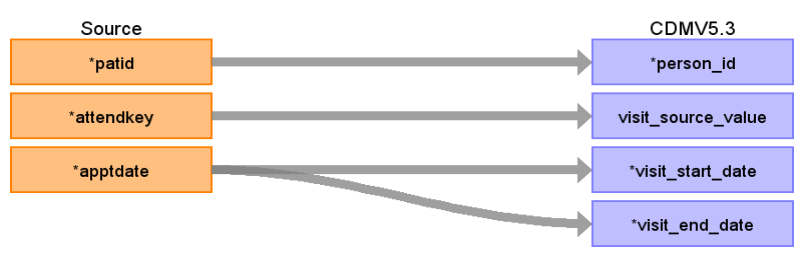

# CDM Table name: VISIT_OCCURRENCE (CDM v5.3 / v5.4)

## Reading from hesop_appointment.
**Reading from hesop_appointment to Visit_Occurrence CDM v5.3/ v5.4 table:**

**Figure.1**

| Destination Field | Source field | Logic | Comment field |
| --- | --- | --- | --- |
| visit_occurrence_id |  |  nextval('public.sequence_vo') AS visit_occurrence_id | A sequence named "sequence_vo" is created in the public schema to uniquely generate "visit_occurrence_id"s. It initializes by fetching the highest ID from the _max_ids table where "tbl_name" equals "visit_occurrence". This table, located in the schema to be linked to the target schema, stores the maximum IDs for all CDM tables to help set the starting point for the next ID in a given sequence.| 
| person_id | patid |  | If attended <> 5 discard visit appointment detail (we accept only attended = 5) |
| visit_concept_id |  | 9202 = "Outpatient visit"  | |
| visit_start_date | apptdate | | Appointment date will be mapped to visit_start_date  |
| visit_start_datetime |apptdate | |  |
| visit_end_date | apptdate| | Appointment date will also be mapped to visit_end_date because its an Outpatient appointment|
| visit_end_datetime |apptdate| | |
| visit_type_concept_id |  | 32818 = "EHR administration record” |  |
| provider_id | provider.provider_id | | use patid+attendkey to retrive "tretspef if tretspef<>‘&’ else use mainspef if mainspef<>'&' else null as speciality" FROM hesop_clinical, inorder to retrieve the source_code_description from source_to_concept_map by LEFT JOINING source_to_concept_map as t1 on hesop_clinical.specialty = t1.source_code AND t1.source_vocabulary_id = “HES_SPEC_STCM”. Which will then be used to retrieve provider_id by LEFT JOINING provider as t2 on t2.specialty_source_value = t1.source_code_description |
| care_site_id |NULL | |  |
| visit_source_value | attendkey | | This will allow us to retrieve Visit_occurrence_id.  |
| visit_source_concept_id | NULL |  |  |
| admitting_source_concept_id | NULL|  | |
| admitting_source_value | NULL |  | |
| discharge_to_concept_id | NULL |  | |
| discharge_to_source_value | NULL |  |  |
| preceding_visit_occurrence_id |  | | Using person_id, look up the attendances that occurred prior to this and put the visit_occurrence_id here.  |

