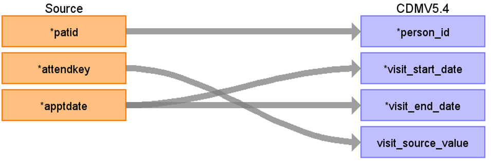

# CDM Table name: VISIT_OCCURRENCE (CDM v5.4)

## Reading from hesop_appointment.
**Reading from hesop_appointment to Visit_Occurrence CDM v5.4 table:**

**Figure.1**

| Destination Field | Source field | Logic | Comment field |
| --- | --- | --- | --- |
| visit_occurrence_id |  |  nextval('public.sequence_vo') AS visit_occurrence_id | 	Autogenerate| 
| person_id | patid |  | If attended <> 5 discard visit appointment detail (we accept only attended = 5) |
| visit_concept_id |  | 9202 = "Outpatient visit"  | |
| visit_start_date | apptdate | |   |
| visit_start_datetime |apptdate | |  |
| visit_end_date | apptdate| | |
| visit_end_datetime |apptdate| | |
| visit_type_concept_id |  | 32818 = "EHR administration record” |  |
| provider_id | provider.provider_id | use patid+attendkey to retrive "tretspef if tretspef<>‘&’ else use mainspef if mainspef<>'&' else null as speciality" FROM hesop_clinical, inorder to retrieve the source_code_description from source_to_concept_map by LEFT JOINING source_to_concept_map as t1 on hesop_clinical.specialty = t1.source_code AND t1.source_vocabulary_id = “HES_SPEC_STCM”. Which will then be used to retrieve provider_id by LEFT JOINING provider as t2 on t2.specialty_source_value = t1.source_code_description | |
| care_site_id |NULL | |  |
| visit_source_value | attendkey | | This will allow us to retrieve Visit_occurrence_id.  |
| visit_source_concept_id | NULL |  |  |
| admitted_from_concept_id | NULL|  | |
| admitted_from_source_value | NULL |  | |
| discharged_to_concept_id | NULL |  | |
| discharged_to_source_value | NULL |  |  |
| preceding_visit_occurrence_id |  | | Using person_id, look up the attendances that occurred prior to this and put the visit_occurrence_id here.  |

