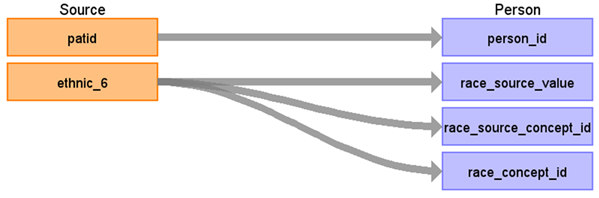

# CDM Table name: Person

## Reading from Ethnicity

| Destination Field | Source field | Logic | Comment field |
| --- | --- | --- | --- |
| person_id | patid | | |
| race_source_value | ethnic_6 | description of ethnic_6 | |
| race_source_concept_id | | 0 | 
| race_concept_id | ethnic_6 | ethnic_6 is mappedd to Race concept id | |
