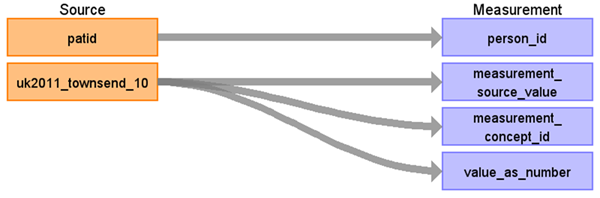

# CDM Table name: Measurement

## Reading from Townsend

The Townsend Index is provided at the practice level and can be linked to patients using the practid. As the source data does not include a specific measurement date, the observation_period_start_date will be used as a proxy.

| Destination Field | Source field | Logic | Comment field |
| --- | --- | --- | --- |
| person_id | patid | | |
| measurement_date | | observation_period_start_date | No measurement date is available in source data. Therefore, the observation_period_start_date will be used as a proxy. |
| measurement_datetime | | observation_period_start_date | |
| measurement_type_concept_id | | [32817 - EHR](https://athena.ohdsi.org/search-terms/terms/32817) | |
| measurement_source_value | uk2011_townsend_10 | |  |
| measurement_source_concept_id | | 0 | |
| measurement_concept_id | uk2011_townsend_10 | [715996 - Townsend deprivation index](https://athena.ohdsi.org/search-terms/terms/715996) | |
| value_as_number | uk2011_townsend_10 | | |
| operator_concept_id | | [4172703 - =](https://athena.ohdsi.org/search-terms/terms/4172703) | |
	