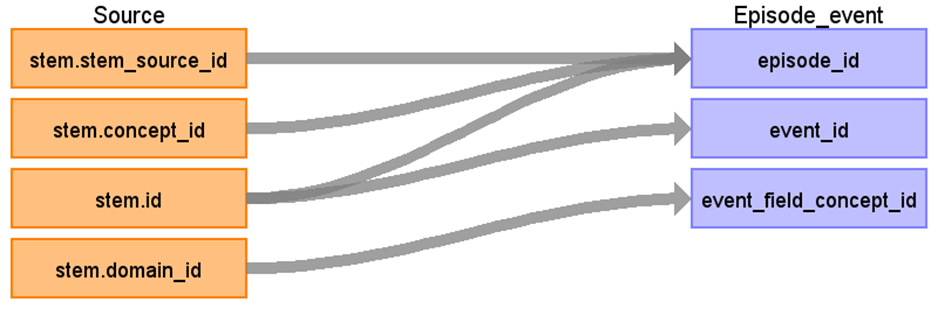

# CDM Table name: Episode Event

## Reading from STEM

All mapped records, regardless of their target domain, that are associated with the same CDM Episode will be linked in the episode_event table using the same episode_id.

| Destination Field | Source field | Logic | Comment field | 
| --- | --- | --- | --- |
| episode_id | STEM.id STEM.stem_source_id STEM.concept_id | Look up STEM based on the unique stem_source_id and and concept_id = 32533. | | 
| event_id | STEM.id | PK of the linked CDM records | |
| event_field_concept_id | STEM.domain_id | [1147127](https://athena.ohdsi.org/search-terms/terms/1147127) if STEM.domain_id = 'Condition' [1147138](https://athena.ohdsi.org/search-terms/terms/1147138) if STEM.domain_id = 'Measurement' [1147082](https://athena.ohdsi.org/search-terms/terms/1147082) if STEM.domain_id = 'Procedure' [1147094](https://athena.ohdsi.org/search-terms/terms/1147094) if STEM.domain_id = 'Drug' [1147049](https://athena.ohdsi.org/search-terms/terms/1147049) if STEM.domain_id = 'Specimen' [1147115](https://athena.ohdsi.org/search-terms/terms/1147115) if STEM.domain_id = 'Device' [1147165](https://athena.ohdsi.org/search-terms/terms/1147165) if STEM.domain_id = 'Observation' OR <> ('Condition', 'Measurement', 'Procedure', 'Drug', 'Specimen', 'Device') |  | 