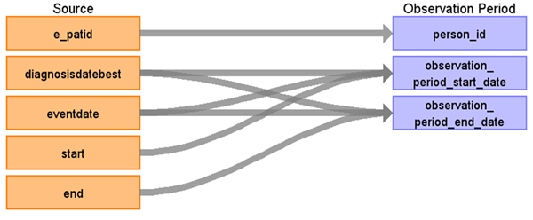

# CDM Table name: observation_period

## Reading from tumour, treatment, linkage_coverage

| Destination Field | Source field | Logic | Comment field | 
| --- | --- | --- | --- |
| observation_period_id | | | Autogenerate| 
| person_id | e_patid |  |  | 
| observation_period_start_date | diagnosisdatebest eventdate start | GREATEST(LEAST(MIN(diagnosisdatebest), MIN(eventdate)), start) | |
| observation_period_end_date | diagnosisdatebest eventdate end | LEAST(GREATEST(MAX(diagnosisdatebest), MAX(eventdate)), end) | |
| period_type_concept_id | | [32880 - Standard algorithm](https://athena.ohdsi.org/search-terms/terms/32880) |
