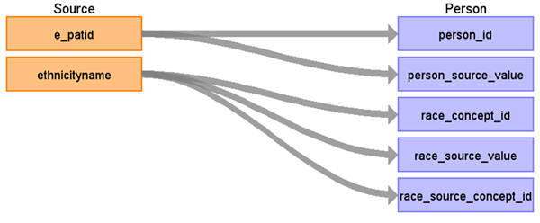

# CDM Table name: PERSON

## Reading from tumour

| Destination Field | Source field | Logic | Comment field |
| --- | --- | --- | --- |
| person_id | e_patid | | |
| gender_concept_id | | 0 | |
| year_of_birth | | 0 | |
| month_of_birth | | | |
| day_of_birth | | | |
| birth_datetime | | | |
| race_concept_id | ethnicityname | ethnicityname will be mapped to Race Concept_id by using NCRAS_ETHNIC_STCM. | |
| ethnicity_concept_id |  | 0 | |
| location_id | | | |
| provider_id | | | |
| care_site_id | | | |
| person_source_value | e_patid | | |
| gender_source_value | | | |
| gender_source_concept_id | | | |
| race_source_value | ethnicityname | | |
| race_source_concept_id | 0 | | |
| ethnicity_source_value | | | |