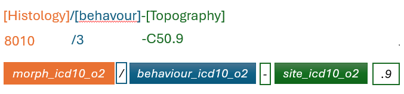

# CDM Table name: stem_table

The STEM table is a staging area where NCRASCR source codes will first be mapped to concept_ids. The STEM table itself is an amalgamation of the OMOP event tables to facilitate record movement. This means that all fields present across the OMOP event tables are present in the STEM table. After a record is mapped and staged, the domain of the concept_id dictates which OMOP table (Condition_occurrence, Drug_exposure, Procedure_occurrence, Measurement, Observation, Device_exposure, Specimen) the record will move to. Please see the STEM -> CDM mapping files for a description of which STEM fields move to which STEM tables.

Fields in the STEM table

| Field		          |
| --- 				  |
| id				  |
| person_id           | 
| visit_occurrence_id | 
| visit_detail_id     | 
| concept_id		  | 
| source_value        | 
| source_concept_id   | 
| type_concept_id     | 
| start_date          | 
| end_date            | 
| start_time          | 
| value_as_number     | 
| value_as_string     | 
| qualifier_concept_id |
| qualifier_source_value | 
| unit_source_value   | 
| value_source_value  | 
| stem_source_table   | 
| stem_source_id      | 

## Reading from tumour

**ONLY NCRAS data within the linkage_coverage period and valid in the database linked (i.e. patients do not exists in the source_nok) to are used in our mapping.**
### Diagnosis

All cancer diagnoses in the form of [Histology]/[behavour]-[Topography] (For example, 8010/3-C50.9) are ideally mapped to the CDM Condition by using ICDO3 vocabulary.  

| Destination Field | Source field | Logic | Comment field |
| --- | --- | --- | --- |
| id |  | | Autogenerate |
| person_id | e_patid | | |
| visit_occurrence_id | | from visit_detail | |
| visit_detail_id | e_cr_id 'tumour' | Look up visit_detail_id based on the unique combination of e_cr_id and source table name | |
| concept_id | morph_icd10_o2 behaviour_icd10_o2 site_icd10_o2 | map these values in the form of [Histology]/[behavour]-[Topography] to the CDM Condition by using ICDO3 vocabulary. | |
| source_value | morph_icd10_o2 behaviour_icd10_o2 site_icd10_o2 | morph_icd10_o2 '/' behaviour_icd10_o2 '-' site_icd10_o2 '.9' | |
| source_concept_id | morph_icd10_o2 behaviour_icd10_o2 site_icd10_o2 | concept_id representing the source_value in Athna | |
| type_concept_id | basisofdiagnosis dco | basisofdiagnosis is mapped by using NCRAS_TUMOUR_BASIS_DIAG_STCM. if basisofdiagnosis=9, dco = 'Y' will be taken into consideration in the mapping. | |
| start_date | diagnosisdatebest | | |
| end_date | diagnosisdatebest | | |
| start_time | | '00:00:00' | |
| stem_source_table   | | 'Tumour'  | | 
| stem_source_id      | e_cr_id | | | 

### Cancer Modifiers

All cancer diagnoses are ideally mapped to the CDM Condition. Cancer modifiers, which include additional diagnostic details such as stage and grade, should be mapped to the CDM Measurement domain. 
These modifiers are linked to the corresponding cancer diagnosis using the measurement_event_id field, which is set to the respective condition_occurrence_id, and the meas_event_field_concept_id, which is assigned the concept ID =[1147127](https://athena.ohdsi.org/search-terms/terms/1147127).
However, some cancer modifiers may not be adequately represented by Athena Measurement concepts. In cases where mapping to the CDM Measurement domain is not feasible, these modifiers are mapped instead to the CDM Observation domain. 

| Destination Field | Source field | Logic | Comment field |
| --- | --- | --- | --- |
| id |  | | Autogenerate |
| person_id | e_patid | | |
| visit_occurrence_id | | from visit_detail | |
| visit_detail_id | e_cr_id 'tumour' | Look up visit_detail_id based on the unique combination of e_cr_id and source table name | |
| concept_id | tumoursize nodesexcised, nodesinvolved tumourcount, bigtumourcount chrl_tot_27_03, chrl_tot_78_06 grade stage_best, stage_img, stage_path t_best, n_best, m_best t_img, n_img, m_img t_path, n_path, m_path gleason_primary, gleason_secondary, gleason_tertiary, gleason_combined | source_value is mapped by using Cancer Modifier, NCRAS_TUMOUR_MODIFIER_STCM, NCRAS_TUMOUR_GRADE_STCM, NCRAS_TUMOUR_GLEASON_PRI_STCM, NCRAS_TUMOUR_GLEASON_SEC_STCM, NCRAS_TUMOUR_GLEASON_TER_STCM and NCRAS_TUMOUR_BASIS_DIAG_STCM | |
| source_value | tumoursize nodesexcised, nodesinvolved tumourcount, bigtumourcount chrl_tot_27_03, chrl_tot_78_06 grade stage_best, stage_img, stage_path t_best, n_best, m_best t_img, n_img, m_img t_path, n_path, m_path gleason_primary, gleason_secondary, gleason_tertiary, gleason_combined | | |
| source_concept_id | tumoursize nodesexcised, nodesinvolved tumourcount, bigtumourcount chrl_tot_27_03, chrl_tot_78_06 grade stage_best, stage_img, stage_path t_best, n_best, m_best t_img, n_img, m_img t_path, n_path, m_path gleason_primary, gleason_secondary, gleason_tertiary, gleason_combined | concept_id representing the source_value in Athna for standard terminology. 0 for customised source_code. | |
| type_concept_id | basisofdiagnosis dco | basisofdiagnosis is mapped by using NCRAS_TUMOUR_BASIS_DIAG_STCM. if basisofdiagnosis=9, dco = 'Y' will be taken into consideration in the mapping. | |
| start_date | diagnosisdatebest | | |
| end_date | diagnosisdatebest | | |
| start_time | | '00:00:00' | |
| value_as_number     | tumoursize nodesexcised, nodesinvolved tumourcount, bigtumourcount chrl_tot_27_03, chrl_tot_78_06 grade stage_best_system, stage_best, stage_img, stage_path stage_img_system, t_best, n_best, m_best t_img, n_img, m_img stage_path_system, t_path, n_path, m_path gleason_primary, gleason_secondary, gleason_tertiary, gleason_combined | | | 
| unit_source_value   | | 'mm' for tumoursize 'month' for chrl_tot_27_03 and chrl_tot_78_06 | | 
| value_source_value  | source data field name | | There are 3 sets of AJCC/UICC code in source data indentified by prefix(e.g. best_, img_, and path_) in the source data field name  | 
| stem_source_table   | | 'Tumour-[modifier name]'  | | 
| stem_source_id      | e_cr_id | | | 

## Reading from treatment

### Treatment

| Destination Field | Source field | Logic | Comment field |
| --- | --- | --- | --- |
| id |  | | Autogenerate |
| person_id | e_patid | | |
| visit_occurrence_id | | from visit_detail | |
| visit_detail_id | e_cr_id 'treatment' | Look up visit_detail_id based on the unique combination of e_cr_id and source table name | |
| concept_id | opcs4_code eventdesc radiodesc chemo_all_drug | source_value is mapped by using OPCS4, RXNorm, RxNorm Extension and NCRAS_STCM. | |
| source_value | opcs4_code eventdesc radiodesc chemo_all_drug | | |
| source_concept_id | opcs4_code eventdesc radiodesc chemo_all_drug | concept_id representing the source_value in Athna for standard terminology. 0 for customised source_code. | |
| type_concept_id | basisofdiagnosis dco | basisofdiagnosis is mapped by using NCRAS_TUMOUR_BASIS_DIAG_STCM. if basisofdiagnosis=9, dco = 'Y' will be taken into consideration in the mapping. | |
| start_date | eventdate | | |
| end_date | eventdate | | |
| start_time | | '00:00:00' | |
| stem_source_table   | | 'Treatment'  | | 
| stem_source_id      | treatment_id | | | 

### Additional information about treatment

| Destination Field | Source field | Logic | Comment field |
| --- | --- | --- | --- |
| id |  | | Autogenerate |
| person_id | e_patid | | |
| visit_occurrence_id | | from visit_detail | |
| visit_detail_id | e_cr_id 'tumour' | Look up visit_detail_id based on the unique combination of e_cr_id and source table name | |
| concept_id | number_of_tumours within_six_months_flag six_months_after_flag lesionsize | source_value is mapped by using NCRAS_TREATMENT_MODIFIER_STCM | |
| source_value | number_of_tumours | | |
| source_concept_id | number_of_tumours | 0 | |
| type_concept_id | basisofdiagnosis dco | basisofdiagnosis is mapped by using NCRAS_TUMOUR_BASIS_DIAG_STCM. if basisofdiagnosis=9, dco = 'Y' will be taken into consideration in the mapping. | |
| start_date | diagnosisdatebest | | |
| end_date | diagnosisdatebest | | |
| start_time | | '00:00:00' | |
| value_as_number     | number_of_tumours lesionsize within_six_months_flag six_months_after_flag |6 for within_six_months_flag and six_months_after_flag | | 
| value_as_string     | within_six_months_flag six_months_after_flag | 'Y'/'N' | |
| unit_source_value   | | 'mm' for lesionsize 'month' for within_six_months_flag and six_months_after_flag | | 
| qualifier_concept_id | within_six_months_flag six_months_after_flag |  [4172704](https://athena.ohdsi.org/search-terms/terms/4172704) for six_months_after_flag [4171754](https://athena.ohdsi.org/search-terms/terms/4171754) for within_six_months_flag | | 
| qualifier_source_value | within_six_months_flag six_months_after_flag | '>' for six_months_after_flag '<=' for within_six_months_flag | | 
| stem_source_table   | | 'Treatment-Modifier'  | | 
| stem_source_id      | treatment_id | | | 

