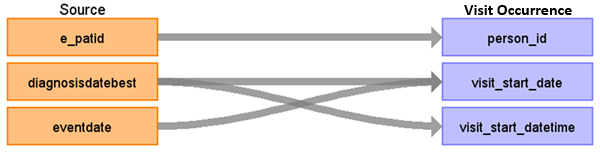

# CDM Table name: visit_detail

## Reading from tumour, treatment

| Destination Field | Source field | Logic | Comment field | 
| --- | --- | --- | --- |
| visit_id | | | Autogenerate| 
| person_id | e_patid |  |  | 
| visit_concept_id | [38004268 - Ambulatory Health Care Facilities, Clinic / Center, Oncology](https://athena.ohdsi.org/search-terms/terms/38004268) | | | 
| visit_start_date | diagnosisdatebest eventdate | | |
| visit_start_datetime | diagnosisdatebest eventdate |  |
| visit_end_date | | Set as visit_start_date | 
| visit_end_datetime | | Set as visit_start_datetime |
| visit_type_concept_id | [32879-Registry](https://athena.ohdsi.org/search-terms/terms/32879) | |
| provider_id | | |
| care_site_id | | |
| visit_source_value | SOURCE_TABLE_NAME | 'Tumour' / 'Treatment' | 
| visit_source_concept_id | | 0 | 
| admitted_from_concept_id | | |
| admitted_from_source_value | | | 
| discharged_to_source_value | | | 
| discharged_to_concept_id | | | 
| preceding_visit_occurrence_id | | Put the visit_id of the last VISIT_DETAIL | 
| parent_visit_id | | |
| visit_occurrence_id | | Put the visit_occurrence_id of the VISIT_OCCURRENCE record that the VISIT_DETAIL record belongs to | 

 			

