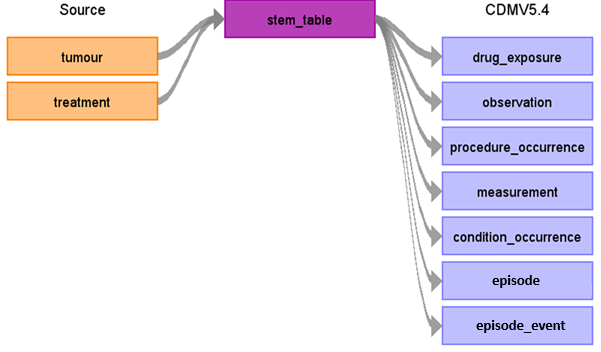

# The Public Health England National Cancer Registration and Analysis Service (NCRAS) ETL Documentation

These materials are meant to serve as documentation and reference for how the NCRAS data was converted to the OMOP Common Data Model (CDM).

