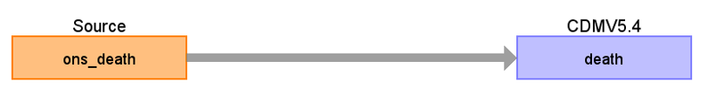

# Office for National Statistics (ONS) Death Registration ETL Documentation

These materials are meant to serve as documentation and reference for how the ONS Death Registration Data was converted to the OMOP Common Data Model (CDM).

## Change log

### 28-Mar-2024
- Creation of documentation
### 04-April-2024
- Updated the title to "Office for National Statistics (ONS) Death Registration"
- Added Death under ONS