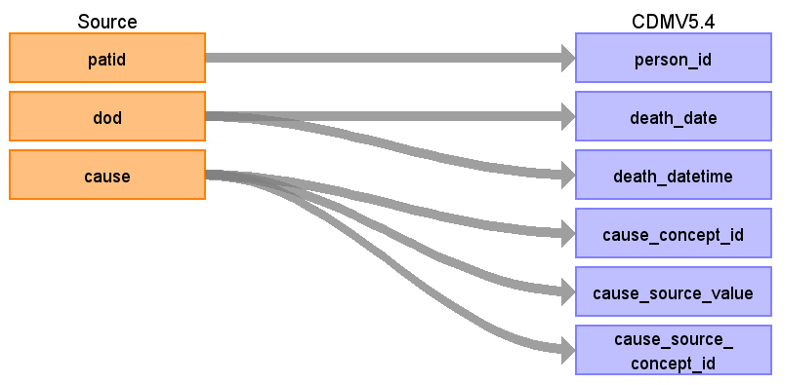

# CDM Table name: DEATH (Tentative name: Death_ONS in database)

## Reading from ONS.Death

Linkage between ONS Mortality data and CPRD primary care data uses an eight-step deterministic linkage algorithm based on four identifiers, shown in Table 1 below. Postcode in the ONS data is based on the usual residence of the deceased as recorded in the death registration data. The linkage is undertaken by NHS Digital, acting as a trusted-third party, on behalf of CPRD. No personal identifiers are held by CPRD, or included in the CPRD GOLD, CPRD Aurum, or linked death registration data.

| Step | Match |
| --- | --- |
| 1 | Exact NHS number, sex, date of birth (DOB), postcode |
| 2 | Exact NHS number, sex, DOB |
| 3 | Exact NHS number, sex, postcode, partial DOB |
| 4 | Exact NHS number, sex, partial DOB |
| 5 | Exact NHS number, postcode |
| 6 | Exact sex, DOB and postcode(where the NHS number does not contradict the match, the DOB is not 1st of January and the postcode is not on the communal establishment list) |
| 7 | Exact sex, DOB and postcode(where the NHS number does not contradict the match and the DOB is not 1st of January) |
| 8 | Exact NHS number | 

The matching steps are applied sequentially. If a CPRD GOLD or CPRD Aurum patient record is matched in one step, it is no longer available for matching in subsequent steps.

CPRD provides users with a match_rank variable which corresponds to the step at which the match was established. In general, a lower value for the match_rank is considered stronger evidence for a positive match. 

**ONLY records with match_rank =1 or 2 are used in our mapping.**

| Destination Field | Source field | Logic | Comment field |
| --- | --- | --- | --- |
| person_id | patid | | |
| death_date | dod | | |
| death_datetime | dod | | |
| death_type_concept_id | | Use [**32815** - Death Certificate](https://athena.ohdsi.org/search-terms/terms/32815) | |
| cause_concept_id | cause | concept.concept_id | |
| cause_source_value | cause | | |
| cause_source_concept_id | cause | concept.concept_id | |
