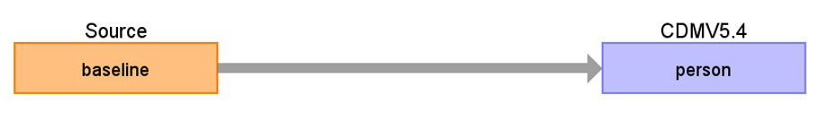

# UK Biobank Baseline ETL Documentation

These materials are meant to serve as documentation and reference for how the UK Biobank Baseline data was converted to the OMOP Common Data Model (CDM).

**UKB Baseline source Data Mapping for CDM v5.4**

**Figure.1**

## Change log

### 03-Oct-2024
- Creation of documentation