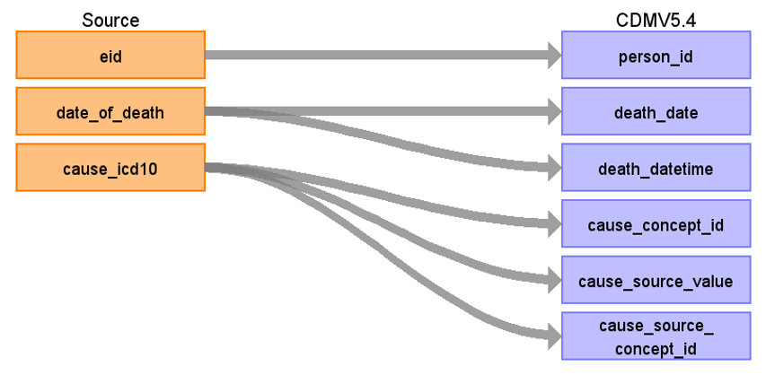

# CDM Table name: DEATH

## Reading from UKB.death, UKB.death_cause

| Destination Field | Source field | Logic | Comment field |
| --- | --- | --- | --- |
| person_id | eid | | |
| death_date | death.date_of_death | | |
| death_datetime | death.date_of_death | | |
| death_type_concept_id | | [32879 - Registry](https://athena.ohdsi.org/search-terms/terms/32879)  | |
| cause_concept_id | death_cause.cause_icd10 | cause_icd10 will be mapped to SNOMED Concept_id by using UKB_DEATH_CAUSE_STCM and ICD10 | It does not allow multiple death records for a single person in CDM Death. However, some ICD10 codes map to multiple standard concepts in Athena. UKB_DEATH_CAUSE_STCM, an STCM-tailored vocabulary, contains the 1:1 mapping information between these codes and standard concepts.   ***For patients with multiple primary causes of death in the source data, the record with ins_index=0 will be selected.**|
| cause_source_value | death_cause.cause_icd10 | | |
| cause_source_concept_id | death_cause.cause_icd10 | Concept_id represents the cause_icd10 in Athena | |
