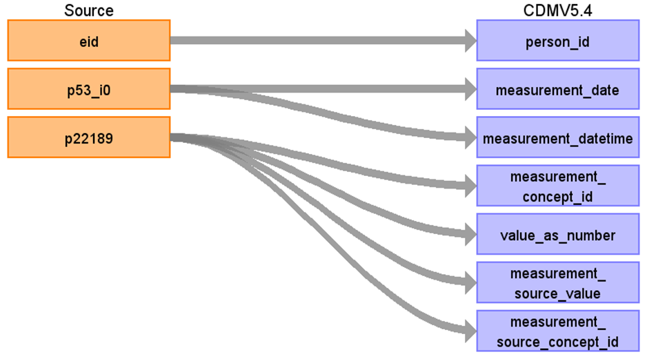

# CDM Table name: MEASUREMENT

## Reading from UKB.baseline

Map p22189 (Townsend deprivation index at recruitment) to CDM Measurement.

| Destination Field | Source field | Logic | Comment field |
| --- | --- | --- | --- |
| measurement_id | | | Autogenerate |
| person_id | eid | | |
| measurement_concept_id | '189' | '189' is the source_code represents p22189 in Athena and it is mapped to Athena Standard Measurement Concept by using UKB_MEASUREMENT_STCM.  | [Data-Field 22189](https://biobank.ndph.ox.ac.uk/ukb/field.cgi?id=22189)|
| measurement_date | p53_i0 | The Townsend deprivation index calculated immediately prior to participant joining UK Biobank. Therefore, the date of Initial assessment visit (2006-2010) at which participants were recruited and consent given is mapped to measurement_date. |[Data-Field 53](https://biobank.ndph.ox.ac.uk/ukb/field.cgi?id=53)|
| measurement_datetime | p53_i0 | | |
| measurement_type_concept_id | | [32880 - Standard algorithm](https://athena.ohdsi.org/search-terms/terms/32880) | |
| value_as_number | p22189 | | |
| measurement_source_value | p22189 | '189' | '189' is the source_code represents p22189 in Athena. |
| measurement_source_concept_id | p22189 | [35810148](https://athena.ohdsi.org/search-terms/terms/35810148) | 35810148 is the concept_id of '189' in Athena |

