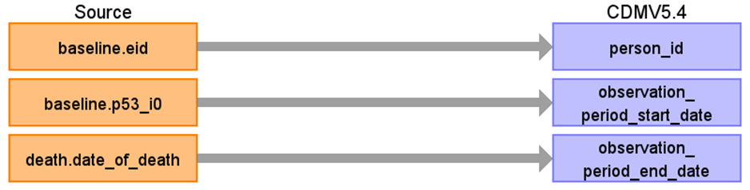

# CDM Table name: observation_period

## Reading from ukb_gp.gp_registrations, ukb_gp.gp_clinical, ukb_gp.gp_scripts, ukb_gp.death

| Destination Field | Source field | Logic | Comment field | 
| --- | --- | --- | --- |
| observation_period_id | | | Autogenerate| 
| person_id | baseline.eid |  |  | 
| observation_period_start_date | baseline.p53_i0 | | [Data-Field 53](https://biobank.ndph.ox.ac.uk/ukb/field.cgi?id=53) |
| observation_period_end_date | death.date_of_death | COALESCE(death.date_of_death, to_date(RIGHT(current_database(), 8), 'YYYYMMDD')) | |
| period_type_concept_id | | [32880 - Standard algorithm](https://athena.ohdsi.org/search-terms/terms/32880) |
