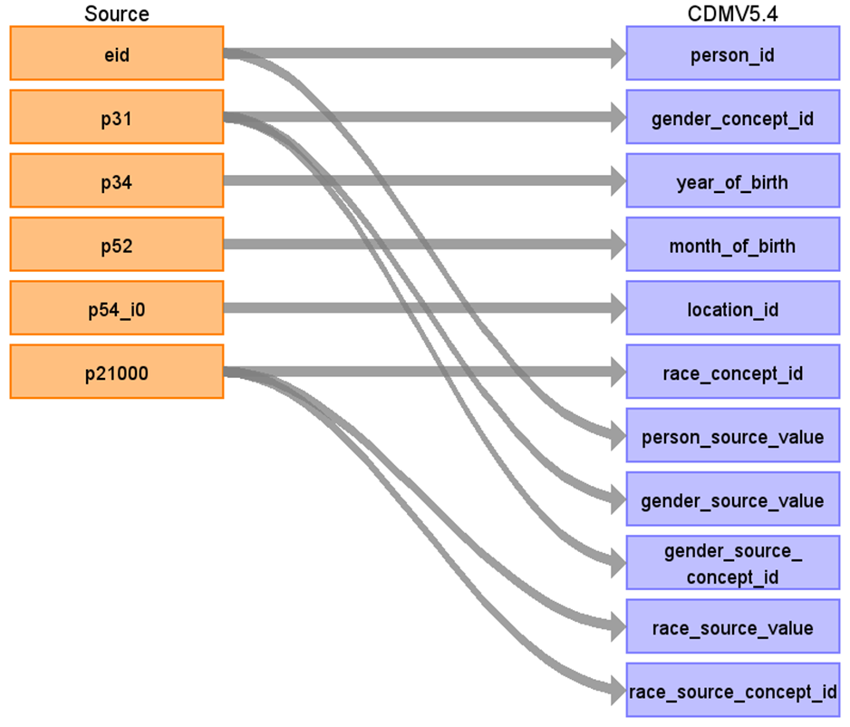

# CDM Table name: PERSON

## Reading from UKB.baseline

| Destination Field | Source field | Logic | Comment field |
| --- | --- | --- | --- |
| person_id | eid | | |
| gender_concept_id | p31 | p31 will be mapped to Gender Concept_id by using UK Biobank vocabulary. | [Data-Field 31](https://biobank.ndph.ox.ac.uk/ukb/field.cgi?id=31)|
| year_of_birth | p34 | | [Data-Field 34](https://biobank.ndph.ox.ac.uk/ukb/field.cgi?id=34)|
| month_of_birth | p52 | | [Data-Field 52](https://biobank.ndph.ox.ac.uk/ukb/field.cgi?id=52)|
| day_of_birth | | | |
| birth_datetime | | | |
| race_concept_id | p21000 | p21000 will be mapped to Race Concept_id by using UK Biobank vocabulary. | [Data-Field 21000](https://biobank.ndph.ox.ac.uk/ukb/field.cgi?id=21000) |
| ethnicity_concept_id | | 0 | |
| location_id | p54_i0 | p54_i0 will be mapped to Geography Concept_id by using UKB_COUNTRY_STCM. | In UK biobank, patient and GP location information is absent. The only available information is the [UK Biobank Assessment Centre (Data-Coding 54)](https://biobank.ndph.ox.ac.uk/ukb/instance.cgi?id=2), which indicates where participants were recruited. |
| provider_id | | | |
| care_site_id | | | |
| person_source_value | eid | | |
| gender_source_value | p31 | | [Data-Field 31](https://biobank.ndph.ox.ac.uk/ukb/field.cgi?id=31)|
| gender_source_concept_id | p31 | Concept_id represents the p31 in Athena | [Data-Field 31](https://biobank.ndph.ox.ac.uk/ukb/field.cgi?id=31) |
| race_source_value | p21000 | | [Data-Field 21000](https://biobank.ndph.ox.ac.uk/ukb/field.cgi?id=21000) |
| race_source_concept_id | p21000 | Concept_id represents the p21000 in Athena | [Data-Field 21000](https://biobank.ndph.ox.ac.uk/ukb/field.cgi?id=21000) |
| ethnicity_source_value | | | NULL |
