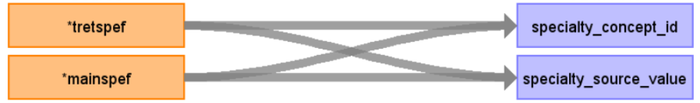

# CDM Table name: PERSON (CDM v5.4)

## Reading from baseline

**Figure.1**

| Destination Field | Source field | Logic | Comment field |
| --- | --- | :---: | --- |
| person_id | eid |  |  |
| gender_concept_id | 0 | | |
| year_of_birth | p34 | | |
| month_of_birth |p52 |  | |
| day_of_birth |NULL  |  |  |
| birth_datetime |NULL  |  |  |
| race_concept_id | p21000_i0 | race_concept_id will be mapped to a standard Concept_id by using baseline.p21000_i0 to retrieve the target_concept_id from source_to_standard_vocab_map where source_code = CONCAT('1001-', baseline.p21000_i0::integer) AND vocabulary_id = 'UK Biobank'| |
| ethnicity_concept_id | 0 |  |   |
| location_id |NULL  |  |  |
| provider_id |NULL  |  |  |
| care_site_id |NULL | |  |
| person_source_value | eid |  |  |
| gender_source_value |p31  | CONCAT('9-', p31)  | |
| gender_source_concept_id | p31 |  gender_source_concept_id will be mapped to a standard Concept_id by using baseline.p31 to retrieve the target_concept_id from source_to_standard_vocab_map where source_code = CONCAT(‘9-‘, baseline.p31) AND target_domain_id = 'Gender' AND vocabulary_id = 'UK Biobank'|  |
| race_source_value | p21000_i0| CONCAT('1001-', baseline.p21000_i0)| |
| race_source_concept_id | p21000_i0 |race_source_concept_id will be mapped to a standard Concept_id by using baseline.p21000_i0 to retrieve the target_concept_id from source_to_standard_vocab_map where source_code = CONCAT('1001-', baseline.p21000_i0::integer) AND vocabulary_id = 'UK Biobank'|
| ethnicity_source_value | NULL |  |  | 