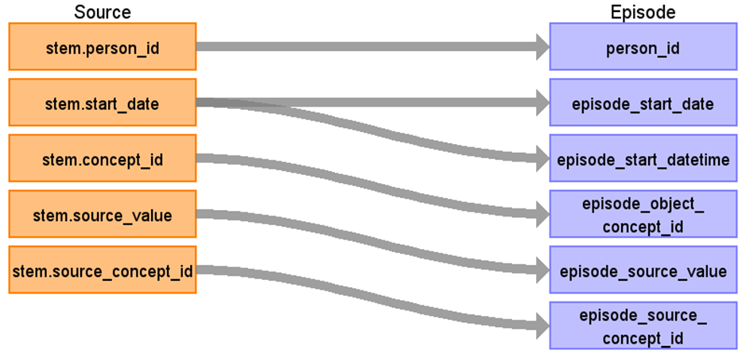

# CDM Table name: Episode

## Reading from STEM  

All mapped cancer diagnoses in CDM Condition are additionally mapped to the CDM Episode, with episode_concept_id set to [32533 (Disease Episode)](https://athena.ohdsi.org/search-terms/terms/32533) and episode_object_concept_id assigned to the corresponding condition_concept_id. Furthermore, all related cancer diagnosis modifiers, regardless of their target domain, are linked to the CDM Episode using the same episode_id via episode_event.

| Destination Field | Source field | Logic | Comment field | 
| --- | --- | --- | --- |
| episode_id | | | Autogenerate| 
| person_id | STEM.person_id |  |  |
| episode_concept_id |  | [32533 Disease Episode](https://athena.ohdsi.org/search-terms/terms/32533) |  |
| episode_type_concept_id |  | [32879 Registry](https://athena.ohdsi.org/search-terms/terms/32879) |  |
| episode_start_date | STEM.start_date |  | |
| episode_start_datetime | STEM.start_date |  | |
| episode_end_date |  | NULL | |
| episode_end_datetime |  | NULL | |
| episode_number |  | NULL | |
| episode_object_concept_id | STEM.concept_id | mapped Condition concepts representing cancer diagnoses | |
| episode_parent_id |  | NULL |  |
| episode_source_value | STEM.source_value |  |  |
| episode_source_concept_id | STEM.source_concept_id |  |  |
