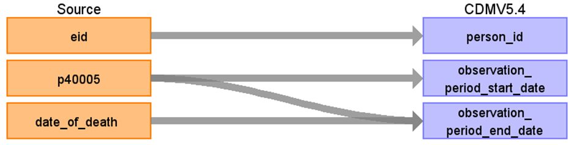

# CDM Table name: observation_period

## Reading from ukb_cancer.cancer_longitude (transform from ukb_cancer.cancer), ukb_cancer.death

| Destination Field | Source field | Logic | Comment field | 
| --- | --- | --- | --- |
| observation_period_id | | | Autogenerate| 
| person_id | eid |  |  | 
| observation_period_start_date | [p40005](https://biobank.ndph.ox.ac.uk/ukb/field.cgi?id=40005) | min(p40005) |  | 
| observation_period_end_date | death.date_of_death [p40005](https://biobank.ndph.ox.ac.uk/ukb/field.cgi?id=40005) | COALESCE(LEAST(death_date, max_p40005), date of datacut) | |
| period_type_concept_id | | [32879-Registry](https://athena.ohdsi.org/search-terms/terms/32879) |
