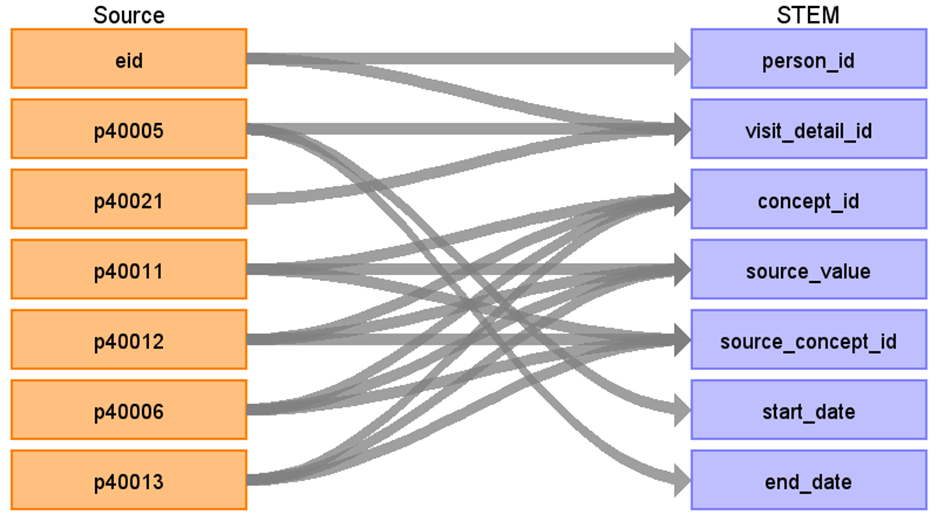

# CDM Table name: stem_table

The STEM table is a staging area where UKB CANCER source codes like Read codes will first be mapped to concept_ids. The STEM table itself is an amalgamation of the OMOP event tables to facilitate record movement. This means that all fields present across the OMOP event tables are present in the STEM table. After a record is mapped and staged, the domain of the concept_id dictates which OMOP table (Condition_occurrence, Drug_exposure, Procedure_occurrence, Measurement, Observation, Device_exposure, Specimen) the record will move to. Please see the STEM -> CDM mapping files for a description of which STEM fields move to which STEM tables. 

**Fields in the STEM table**

| Field |
| --- |
| id | 
| domain_id |  
| person_id | 
| visit_occurrence_id | 
| visit_detail_id |
| concept_id | 
| source_value |
| source_concept_id |
| type_concept_id | 
| start_date |  
| end_date |  
| start_time | 
| measurement_event_id | 
| meas_event_field_concept_id | 

## Reading from ukb_cancer.cancer_longitude (transform from ukb_cancer.cancer)

The cancer data in ukb_cancer.cancer is stored in a latitudinal format, meaning that all cancer records for a single patient are stored in a single row. This structure makes the ETL process challenging and inefficient. To address this, a transformation is required before performing the ETL, converting the data into a longitudinal format, which stores the cancer records in ukb_cancer.cancer_longitude.

The UK Biobank cancer data contains only cancer diagnoses: histology, behavior, and topography information.
These diagnoses are ideally mapped in the form of ****[Histology]/[behavour]-[Topography]**** (For example, ****8010/3-C50.9****) to the CDM Condition.
However, not all cancer diagnoses in this form can be directly mapped to a single concept in the Condition domain. 
For cases where a direct mapping is not possible, the histology and behavior components (e.g., ****8010/3****) are mapped as the primary cancer diagnosis in the Condition table. The topography component is then separately mapped to the Measurement table or other appropriate CDM tables as additional diagnostic information.
When any additional diagnostic information are mapped to the CDM Measurement, they are linked to the corresponding cancer diagnosis in the CDM Condition using the measurement_event_id field, which is set to the condition_occurrence_id of the associated diagnosis. 
The meas_event_field_concept_id is assigned the concept ID 1147127 to establish this linkage.

| Destination Field | Source field | Logic | Comment field | 
| --- | --- | --- | --- |
| id | | | Autogenerate| 
| domain_id | | This should be the domain_id of the standard concept in the concept_id field. If an entity type is mapped to concept_id 0 or concept_id is not in the Condition, Procedure, Drug, Measurement, Specimen, or Device domains, put the domain_id as Observation. |
| person_id | eid |  |  | 
| visit_occurrence_id | | from visit_detail  |  | 
| visit_detail_id | eid [p40005](https://biobank.ndph.ox.ac.uk/ukb/field.cgi?id=40005) [p40021](https://biobank.ndph.ox.ac.uk/ukb/field.cgi?id=40021) | Look up visit_detail_id based on the unique combination of eid, p40005 and p40021.| |
| concept_id | [p40011](https://biobank.ndph.ox.ac.uk/ukb/field.cgi?id=40011) [p40012](https://biobank.ndph.ox.ac.uk/ukb/field.cgi?id=40012) [p40006](https://biobank.ndph.ox.ac.uk/ukb/field.cgi?id=40006) [p40013](https://biobank.ndph.ox.ac.uk/ukb/field.cgi?id=40013) | source_value in the form of ****[Histology]/[behavour]-[Topography]**** is mapped to Condition Concept(s) by using ICDO3.  For those cannot be mapped in the above form: 1. source_value in the form of ****[Histology]/[behavour]**** is mapped to Condition Concept(s) by using ICDO3 and CANCER_ICDO3_STCM. 2. The topography information in the source_value is then separately mapped by using ICDO3, ICD10 and ICD9CM and CANCER_ICDO3_STCM. ||
| source_value | [p40011](https://biobank.ndph.ox.ac.uk/ukb/field.cgi?id=40011) [p40012](https://biobank.ndph.ox.ac.uk/ukb/field.cgi?id=40012) [p40006](https://biobank.ndph.ox.ac.uk/ukb/field.cgi?id=40006) [p40013](https://biobank.ndph.ox.ac.uk/ukb/field.cgi?id=40013) | |
| source_concept_id | source_value | Concept_id represents source_value in Athena |
| type_concept_id | | [32879 - Registry](https://athena.ohdsi.org/search-terms/terms/32879) |
| start_date | [p40005](https://biobank.ndph.ox.ac.uk/ukb/field.cgi?id=40005) | |
| end_date | [p40005](https://biobank.ndph.ox.ac.uk/ukb/field.cgi?id=40005) | |
| start_time | | 00:00:00 |
| measurement_event_id | |  condition_occurrence_id of the linked additional diagnostic information | | 
| meas_event_field_concept_id | domain_id | [1147127](https://athena.ohdsi.org/search-terms/terms/1147127) | | 

