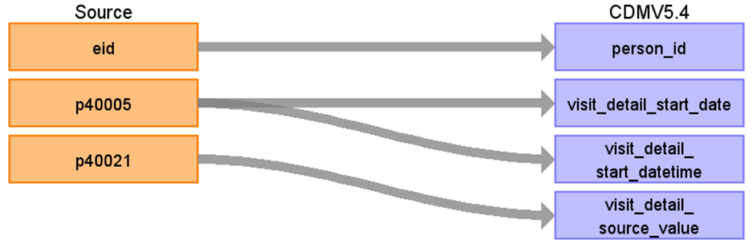

# CDM Table name: visit_detail

## Reading from ukb_cancer.cancer_longitude (transform from ukb_cancer.cancer)

| Destination Field | Source field | Logic | Comment field | 
| --- | --- | --- | --- |
| visit_detail_id | | | Autogenerate| 
| person_id | eid |  |  | 
| visit_detail_concept_id | [38004268 - Ambulatory Health Care Facilities, Clinic / Center, Oncology](https://athena.ohdsi.org/search-terms/terms/38004268) | |  | 
| visit_detail_start_date | p40005 | | |
| visit_detail_start_datetime | p40005 |  |
| visit_detail_end_date | | Set as visit_detail_start_date | 
| visit_detail_end_datetime | | Set as visit_detail_start_datetime |
| visit_detail_type_concept_id | [32879-Registry](https://athena.ohdsi.org/search-terms/terms/32879) | |
| provider_id | | |
| care_site_id | | |
| visit_detail_source_value | [p40021](https://biobank.ndph.ox.ac.uk/ukb/search.cgi?wot=0&srch=40021&yfirst=2000&ylast=2024) | set as description of p40021 by joining [lookup1970](https://biobank.ndph.ox.ac.uk/ukb/coding.cgi?id=1970) | 
| visit_detail_source_concept_id | | 0 | 
| admitted_from_concept_id | | |
| admitted_from_source_value | | | 
| discharged_to_source_value | | | 
| discharged_to_concept_id | | | 
| preceding_visit_detail_id | | Put the visit_detail_id of the last VISIT_DETAIL | 
| parent_visit_detail_id | | |
| visit_occurrence_id bigint | | Put the visit_occurrence_id of the VISIT_OCCURRENCE record that the VISIT_DETAIL record belongs to | 
