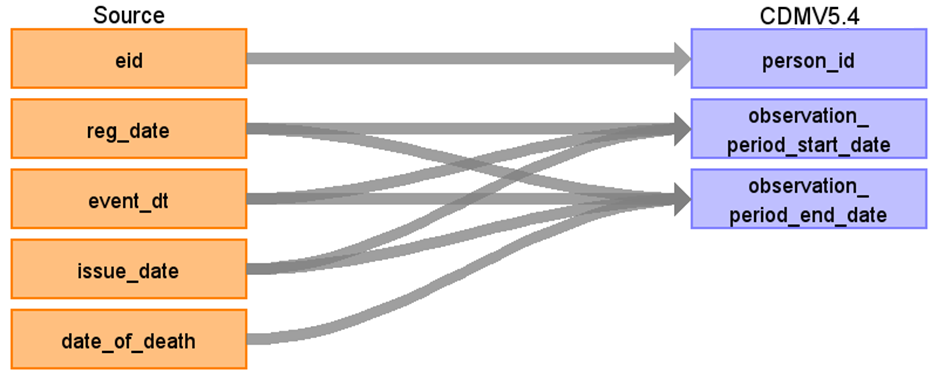

# CDM Table name: observation_period

## Reading from ukb_gp.gp_registrations, ukb_gp.gp_clinical, ukb_gp.gp_scripts, ukb_gp.death

| Destination Field | Source field | Logic | Comment field | 
| --- | --- | --- | --- |
| observation_period_id | | | Autogenerate| 
| person_id | eid |  |  | 
| observation_period_start_date | gp_registrations.reg_date gp_clinical.event_dt gp_scripts.issue_date | LEAST(t2.reg_date, MIN(event_dt), MIN(issue_date)) | [Please note that not all participants with primary care data available have a corresponding registration record.](https://biobank.ndph.ox.ac.uk/ukb/field.cgi?id=42038) Therefore, gp_clinical.event_dt, gp_scripts.issue_date are also taken into consideration. | 
| observation_period_end_date | death.date_of_death gp_clinical.event_dt gp_scripts.issue_date | COALESCE(LEAST(death_date, GREATEST(MAX(event_dt), MAX(issue_date)), date of datacut) | |
| period_type_concept_id | | [32880 - Standard algorithm](https://athena.ohdsi.org/search-terms/terms/32880) |
