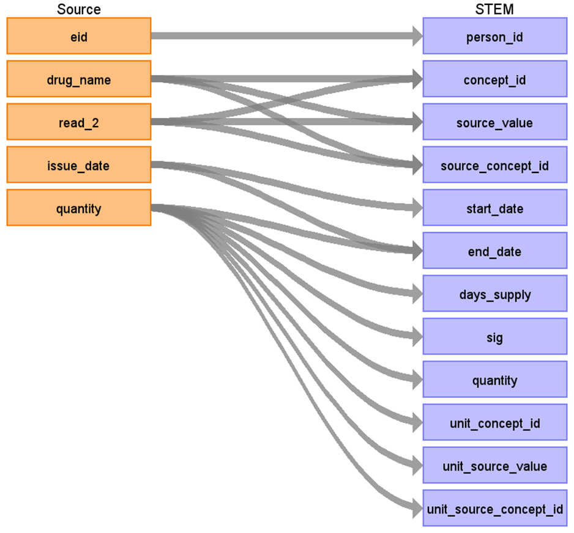
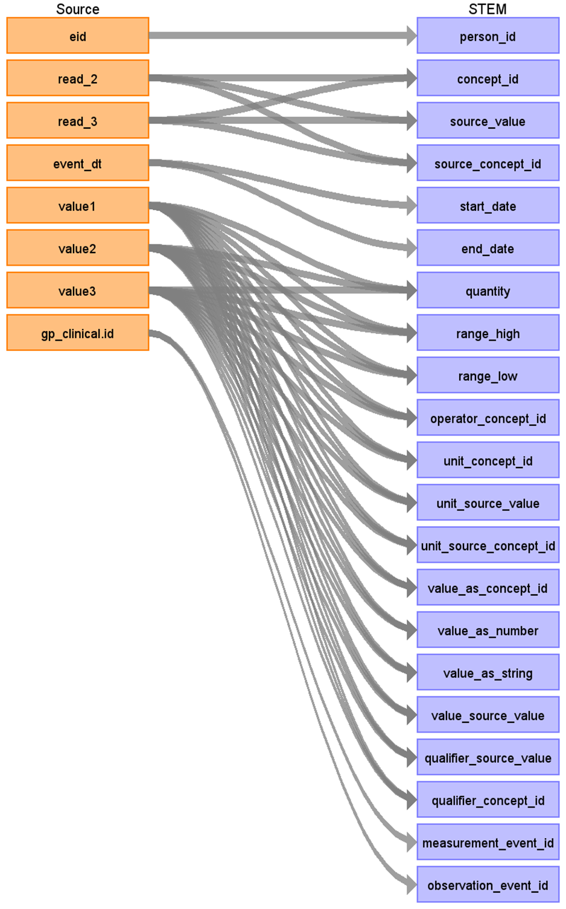

# CDM Table name: stem_table

The STEM table is a staging area where UKB GP source codes like Read codes will first be mapped to concept_ids. The STEM table itself is an amalgamation of the OMOP event tables to facilitate record movement. This means that all fields present across the OMOP event tables are present in the STEM table. After a record is mapped and staged, the domain of the concept_id dictates which OMOP table (Condition_occurrence, Drug_exposure, Procedure_occurrence, Measurement, Observation, Device_exposure, Specimen) the record will move to. Please see the STEM -> CDM mapping files for a description of which STEM fields move to which STEM tables. 

**Fields in the STEM table**

| Field |
| --- |
| id | 
| domain_id |  
| person_id | 
| visit_occurrence_id | 
| visit_detail_id |
| concept_id | 
| source_value |
| source_concept_id |
| type_concept_id | 
| start_date |  
| end_date |  
| start_time | 
| days_supply |
| sig |
| quantity |
| value_as_number |
| value_as_string |
| value_as_concept_id |
| value_source_value |
| range_low |
| range_high |
| operator_concept_id |
| qualifier_source_value |
| qualifier_concept_id |
| unit_source_value |
| unit_source_concept_id |
| measurement_event_id | 
| meas_event_field_concept_id |
| observation_event_id |
| obs_event_field_concept_id |
| stem_source_table |
| stem_source_id |

## Reading from ukb_gp.temp_gp_scripts_2 (created by linking ukb_gp.gp_scripts to CDM GOLD lookup tables) 
Duplication in gp_scripts will not be treated as identical prescriptions, as a GP may intentionally issue identical prescriptions. For instance, this could occur if a patient requires extra medication for travel or if the software system imposes prescription limitations. All such instances are accounted for.

Day supply information for prescriptions is essential for constructing the CDM Drug_era. However, in the source data, less than 1% of prescription records(in the quantity data field) include this information. 
To address this gap, a 'numdays' value as the day supply in CDM Drug_exposure has been assigned by linking the source data with three CDM GOLD lookup tables: **gold_product**, **gold_daysupply_decodes**, **gold_daysupply_modes**. 
These tables contain dmd code, pharmacy product name, and the most frequent prescriptions based on quantity, and pack size. 
This approach leverages the common data source between CPRD Gold and the UK Biobank, both of which use Vision® software. 

No suggested day supply is assigned if the source data already contains day supply information or if no corresponding drugs are found in the CDM GOLD lookup tables. For cases where day supply is represented as 'month' in the source data, the day supply is calculated as a multiple of 28, which is the most frequent 'numdays' value.

**Researchers must decide whether to use the suggested day supply or define it independently.** The source quantity information can be found in the 'sig' data field within CDM Drug_exposure.

| Destination Field | Source field | Logic | Comment field | 
| --- | --- | --- | --- |
| id | | | Autogenerate| 
| domain_id | | 'Device' or 'Drug'. If an entity type is mapped to concept_id 0, put the domain_id as Observation. |
| person_id | eid |  |  | 
| visit_occurrence_id | | from visit_detail  |  | 
| visit_detail_id | | Put the visit_detail_id of the corresponding VISIT_DETAIL record. | |
| concept_id | drug_name read_2 | source_value will be mapped to Athena Standard Concept by using UKB_GP_SCRIPT_DRUG_STCM and UKB_GP_SCRIPT_READ_STCM. | |
| source_value | drug_name read_2 | use drug_name if concept_id is mapped by drug_name or read_2 if concept_id is mapped by read_2 |
| source_concept_id | | concept_id represent unit_source_value in Athena or 0 if it doesn't exist in Athena. |
| type_concept_id | | [32817 - EHR](https://athena.ohdsi.org/search-terms/terms/32817) |
| start_date | issue_date | |
| end_date | issue_date days_supply | issue_date + COALESCE(days_supply, 0) | **The observation_period_end_date does not take days_supply into account, meaning the end_date may be extend beyond the observation period when days_supply is added.** |
| start_time | | 00:00:00 |
| days_supply | quantity | extract day supply information in quantity, given that if it is represented as 'month', *28  if day supply information doesn't exists, use numdays provided by CDM GOLD lookup tables. | | 
| sig | quantity | | for researchers' reference |  
| quantity | quantity | extract numeric value in quantity | |
| unit_concept_id | quantity | unit_source_value will be mapped to Athena Standard Concept by using UKB_GP_DEVICE_UNIT_STCM 
| unit_source_value | quantity | extract unit in quantity | 
| unit_source_concept_id | concept_id represent unit_source_value in Athena or 0 if it doesn't exist in Athena. |
| stem_source_table | | 'gp_scripts' | |
| stem_source_id | gp_scripts.id | |

## Reading from ukb_gp.gp_clinical
Duplicate entries in gp_clinical will be considered identical and mapped only once.

| Destination Field | Source field | Logic | Comment field | 
| --- | --- | --- | --- |
| id | | | Autogenerate| 
| domain_id | | This should be the domain_id of the standard concept in the concept_id field. If an entity type is mapped to concept_id 0 or concept_id is not in the Condition, Procedure, Drug, Measurement, Specimen, or Device domains, put the domain_id as Observation. |
| person_id | eid |  |  | 
| visit_occurrence_id | | from visit_detail  |  | 
| visit_detail_id | | Put the visit_detail_id of the corresponding VISIT_DETAIL record. | |
| concept_id | read_2 read_3 | source_value will be mapped to Athena Standard Concept by using Read vocabulary and UKB_GP_CLINICAL_READ_STCM. | |
| source_value | read_2 read_3 | use read_2 if concept_id is mapped by read_2 or read_3 if concept_id is mapped by read_3 | |
| source_concept_id | read_2 read_3 | concept_id represent source_value in Athena or 0 if it doesn't exist in Athena. |
| type_concept_id | | [32817 - EHR](https://athena.ohdsi.org/search-terms/terms/32817) |
| start_date | event_dt | |
| end_date | event_dt | |
| start_time | | 00:00:00 |
| quantity | value1 value2 value3 | extract numeric value in value1, value2 and value3 | 
| range_high | value1 value2 value3 | extract the largest numeric value in value1, value2 and value3 | 
| range_low | value1 value2 value3 | extract the lowest numeric value in value1, value2 and value3 | 
| operator_concept_id | value1 value2 value3 | map the operator information extrated from value1, value2 and value3 to [Athena Standard Operator Concept](https://athena.ohdsi.org/search-terms/terms?domain=Meas+Value+Operator&standardConcept=Standard&page=1&pageSize=15&query=) | 
| unit_concept_id | value1 value2 value3 | unit_source_value will be mapped to Athena Standard Concept by using UKB_GP_CLINICAL_UNIT_STCM
| unit_source_value | value1 value2 value3 | extract the unit value in value1, value2 and value3 |  
| unit_source_concept_id | value1 value2 value3 | concept_id represent unit_source_value in Athena or 0 if it doesn't exist in Athena. |
| value_as_concept_id | value1 value2 value3 | map value1, value2 and value3 to Athena Standard Concept by using Read vocabulary |  
| value_as_number | value1 value2 value3 | extract numeric value in value1, value2 and value3 |  
| value_as_string | value1 value2 value3 | extract non-numeric value in value1, value2 and value3 |  
| value_source_value | value1 value2 value3 | extract non-numeric value in value1, value2 and value3 |  
| qualifier_source_value | value1 value2 value3 | extract qualifier in value1, value2 and value3 |  
| qualifier_concept_id | value1 value2 value3 | qualifier_source_value will be mapped to [Athena Standard Qualifier Concept](https://athena.ohdsi.org/search-terms/terms?conceptClass=Qualifier+Value&invalidReason=Valid&standardConcept=Standard&page=1&pageSize=15&query=) |  
| stem_source_table | | 'gp_clinical' | |
| stem_source_id | gp_clinical.id | |
| measurement_event_id | gp_clinical.id | Link the related records by using gp_clinical.id and the table name, 'gp_clinical' and put the primary key of the linked record. | |
| meas_event_field_concept_id | | if the related records belongs to domain_id = 'Condition' [1147127](https://athena.ohdsi.org/search-terms/terms/1147127) domain_id = 'Procedure' [1147082](https://athena.ohdsi.org/search-terms/terms/1147082) domain_id = 'Observation' [1147165](https://athena.ohdsi.org/search-terms/terms/1147165) domain_id = 'Measurement' [1147138](https://athena.ohdsi.org/search-terms/terms/1147138) | 
| observation_event_id | gp_clinical.id | Link the related records by using gp_clinical.id and the table name, 'gp_clinical' and put the primary key of the linked record.  |
| obs_event_field_concept_id |  | if the related records belongs to domain_id = 'Condition' [1147127](https://athena.ohdsi.org/search-terms/terms/1147127) domain_id = 'Procedure' [1147082](https://athena.ohdsi.org/search-terms/terms/1147082) domain_id = 'Observation' [1147165](https://athena.ohdsi.org/search-terms/terms/1147165) domain_id = 'Measurement' [1147138](https://athena.ohdsi.org/search-terms/terms/1147138) | 

