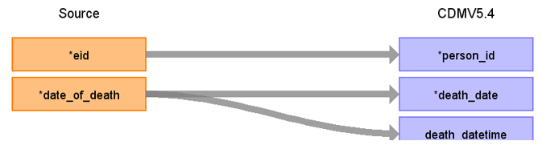

# CDM Table name: DEATH (CDM v5.3 / v5.4)

## Reading from DEATH_CAUSE

**Figure.1**

| Destination Field | Source field | Logic | Comment field |
| --- | --- | :---: | --- |
| person_id| eid | | |
| death_date| NULL | | |
| death_datetime| NULL | | |
| death_type_concept_id| | 32879 = Registry | |
| cause_concept_id| cause_icd10 | use cause_icd10 to retrieve the concept_id from CONCEPT table by doing a JOIN to public.concept as t1 on t1.concept_code = death_cause.cause_icd10 where vocabulary_id = 'ICD10' AND source_vocabulary_id = 'UKB_DEATH_CAUSE_STCM'| |
| cause_source_value| cause_icd10 | | |
| cause_source_concept_id| cause_icd10 | | |

## Reading from DEATH

**Figure.2**

| Destination Field | Source field | Logic | Comment field |
| --- | --- | :---: | --- |
| person_id| eid | | |
| death_date| date_of_death | | |
| death_datetime| date_of_death | | |
| death_type_concept_id| | 32879 = Registry | |
| cause_concept_id|  NULL| | |
| cause_source_value| NULL| | |
| cause_source_concept_id| NULL | | |