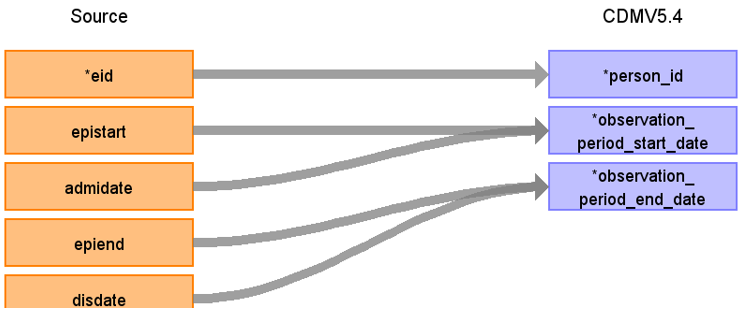

# CDM Table name: observation_period (CDM v5.4)

## Reading from hesin, death

| Destination Field | Source field | Logic | Comment field |
| --- | --- | :---: | --- |
| observation_period_id |  |  |  Autogenerate|
| person_id | eid | | |
| observation_period_start_date | epistart, admidate| | use the earliest of the two date fields that is not null.|
| observation_period_end_date |death.date_of_death, epiend, disdate, admidate, epistart |Use admidate, epistart when disdate and epiend are null | use the latest of disdate, epiend, and admidate, then the earliest between that and date_of_death.|
| period_type_concept_id | | [32880 - Standard algorithm](https://athena.ohdsi.org/search-terms/terms/32880)| |
