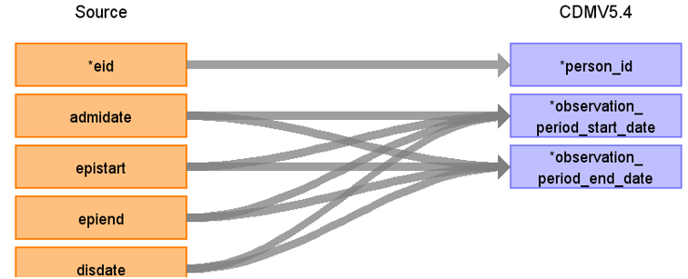

# CDM Table name: observation_period (CDM v5.4)

## Reading from hesin, death

| Destination Field | Source field | Logic | Comment field |
| --- | --- | :---: | --- |
| observation_period_id |  |  |  Autogenerate|
| person_id | eid | | |
| observation_period_start_date | admidate, epistart, disdate, epiend| Use all four fields in case some of them are null | use the earliest of (admidate,epistart,disdate,epiend) that is not null.|
| observation_period_end_date |death.date_of_death, disdate, epiend, admidate, epistart |Use all four fields in case some of them are null| use the latest of (disdate, epiend, admidate, epistart) that is not null, then the earliest between that and death.date_of_death.|
| period_type_concept_id | | [32880 - Standard algorithm](https://athena.ohdsi.org/search-terms/terms/32880)| |
