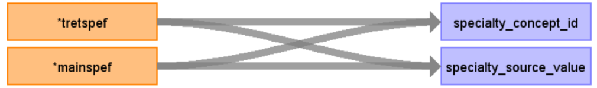

# CDM Table name: provider (CDM v5.4)

## Reading from hesin

| Destination Field | Source field | Logic | Comment field |
| --- | --- | :---: | --- |
| provider_id | | | Autogenerate|
| provider_name | NULL |  |  |
| npi | NULL |  |  |
| dea |NULL  |  |  |
| specialty_concept_id | tretspef, mainspef | In the absence of a provider_id, we have created a dummy provider_id's, each associated with a different specialty, using the first available value from either tretspef or mainspef. ||
| care_site_id | NULL| | |
| year_of_birth | NULL |  |  |
| gender_concept_id | NULL | |  |
| provider_source_value | NULL |  | |
| specialty_source_value | tretspef, mainspef | ||
| specialty_source_concept_id |NULL  |  | |
| gender_source_value | NULL| |  |
| gender_source_concept_id | NULL |  | |