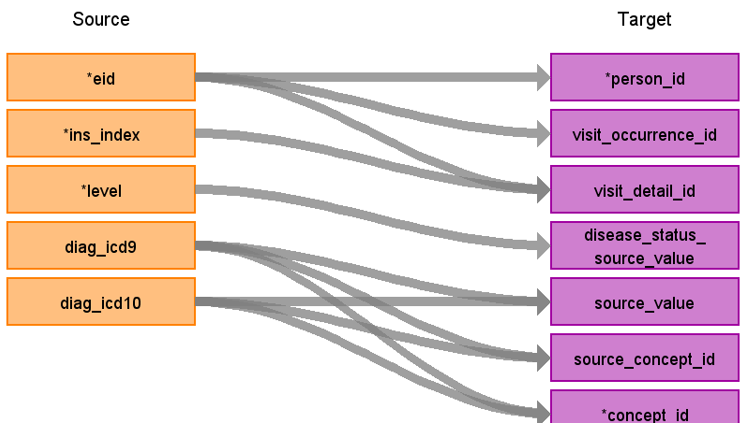

# CDM Table name: stem_table (CDM v5.4)

## Reading from hesin_diag, hesin

| Destination Field | Source field | Logic | Comment field |
| --- | --- | :---: | --- |
| id|||Autogenerate|
| domain_id | NULL | | | 
| person_id | eid | | | 
| visit_occurrence_id |eid, hesin.spell_index | | Use eid, hesin.spell_index to retrieve visit_occurrence_id |
| visit_detail_id|eid, ins_index ||Use eid, ins_index to retrieve visit_detail_id |
| source_value| diag_icd9, diag_icd10 |Add dots when necessary | ICD9 & ICD10 codes provided without dots|
| source_concept_id | diag_icd9, diag_icd10 | | |
| type_concept_id |  | 32829 | |
| start_date | hesin.epistart, hesin.admidate | | If hesin.epistart is null use hesin.admidate|
| start_datetime | hesin.epistart, hesin.admidate|   | |
| end_date | hesin.epiend, hesin.disdate, hesin.epistart, hesin.admidate | | Use the first not null of (hesin.epiend,hesin.disdate,hesin.epistart,hesin.admidate)|
| end_datetime | hesin.epiend, hesin.disdate, hesin.epistart, hesin.admidate | | |
| concept_id  | NULL |  |  |
| disease_status_source_value | | | |
| stem_source_table | | "hesin_diag" | |
 
## Reading from hesin_oper, hesin

| Destination Field | Source field | Logic | Comment field |
| --- | --- | :---: | --- |
| id|||Autogenerate|
| domain_id | NULL | | | 
| person_id | eid | | | 
| visit_occurrence_id |eid, hesin.spell_index | | Use eid, hesin.spell_index to retrieve visit_occurrence_id |
| visit_detail_id|eid, ins_index ||Use eid, ins_index to retrieve visit_detail_id |
| source_value| oper4 | Add dots when necessary| OPCS4 Codes are provided without dots|
| source_concept_id | oper4 | | |
| type_concept_id |  | 32829 | |
| modifier_source_value |  | | |
| start_date | opdate, hesin.epistart | | If opdate is null then use hesin.epistart|
| start_datetime | opdate, hesin.epistart |   | |
| end_date | opdate, hesin.epiend | | If opdate is null then use hesin.epiend |
| end_datetime | opdate, hesin.epistart  | | |
| concept_id  | NULL  |  |  |
| stem_source_table | | "hesin_oper" | |