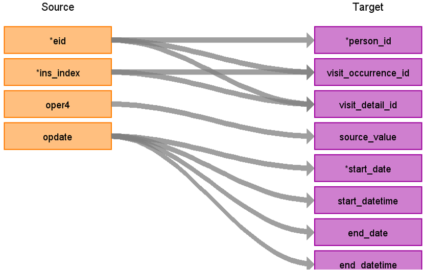

# CDM Table name: stem_table (CDM v5.4)

## Reading from hesin_diag

**Figure.1**

| Destination Field | Source field | Logic | Comment field |
| --- | --- | :---: | --- |
| id|||Removed for performance reasons|
| domain_id | NULL | | | 
| person_id | eid | | | 
| visit_occurrence_id |eid,ins_index | | Use eid+ins_index to retrieve visit_occurrence_id |
| visit_detail_id|eid,ins_index ||Use eid+ins_index to retrieve visit_detail_id |
| source_value| diag_icd9,diag_icd10 |CONCAT(LEFT(COALESCE(diag_icd9, diag_icd10), 3), '.', RIGHT(COALESCE(diag_icd9, diag_icd10), 1))||
| source_concept_id | diag_icd9,diag_icd10 | concept_id of either diag_icd9 or diag_icd10 | |
| type_concept_id |  | 32829 | |
| start_date | epistart | | |
| end_date | epiend | | |
| start_datetime | epistart |   | |
| concept_id  | NULL |  |  |
| end_datetime | epiend| | |
| disease_status_source_value | | | |
| stem_source_table | | "hesin_diag" | |
 
## Reading from hesin_oper

**Figure.1**

| Destination Field | Source field | Logic | Comment field |
| --- | --- | :---: | --- |
| id|||Removed for performance reasons|
| domain_id | NULL | | | 
| person_id | eid | | | 
| visit_occurrence_id |eid,ins_index | | Use eid+ins_index to retrieve visit_occurrence_id |
| visit_detail_id|eid,ins_index ||Use eid+ins_index to retrieve visit_detail_id |
| source_value| oper4 | CONCAT(LEFT(oper4, 3), '.', RIGHT(oper4, 1))||
| source_concept_id | oper4 | concept_id of oper4 | |
| type_concept_id |  | 32829 | |
| modifier_source_value | level | | |
| start_date | opdate | | |
| start_datetime | opdate |   | |
| end_date | opdate | | |
| end_datetime | opdate | | |
| end_datetime | opdate | | |
| concept_id  | NULL  |  |  |
| stem_source_table | | "hesin_oper" | |