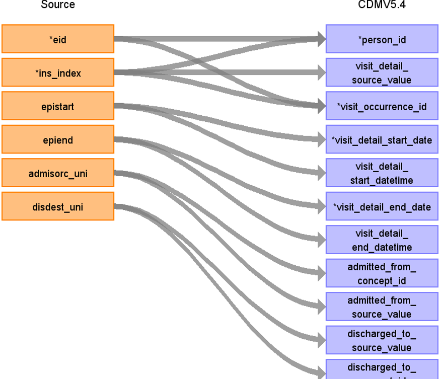
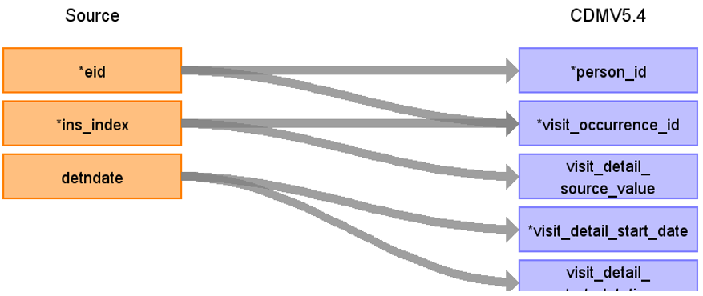
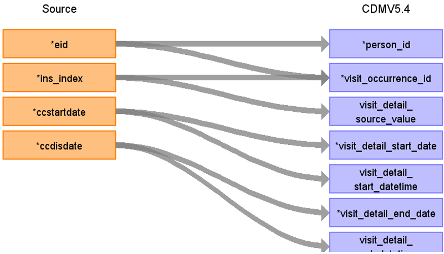

# CDM Table name: VISIT_DETAIL (CDM v5.4)

## Reading from hesin

**Figure.1**

| Destination Field | Source field | Logic | Comment field |
| --- | --- | :---: | --- |
| visit_detail_id| | NEXTVAL('public.sequence_vd')| Autogenerate|
| person_id| eid | | |
| visit_detail_concept_id| | 9201 = Inpatient visit| |
| visit_detail_start_date | epistart | COALESCE(MIN(epistart), admidate, disdate)|    |
| visit_detail_start_datetime| epistart | COALESCE(MIN(epistart), admidate, disdate)|  |
| visit_detail_end_date | epiend| COALESCE(MAX(epiend), MIN(epistart), disdate)|  |
| visit_detail_end_datetime | epiend | COALESCE(MAX(epiend), MIN(epistart), disdate) | |
| visit_detail_type_concept_id| | 32818 = EHR administration record| |
| provider_id| NULL | | |
| care_site_id| NULL | | |
| visit_detail_source_value| ins_index | | |
| visit_detail_source_concept_id| NULL | | |
| admitted_from_concept_id | admisorc_uni | use admisorc_uni to retrieve the target_concept_id from source_to_standard_vocab_map by doing a INNER JOIN to source_to_standard_vocab_map as t1 on CONCAT('264-',hesin.admisorc_uni) = t1.source_code AND t1.target_domain_id = 'visit' AND t1.source_vocabulary_id = “UKB_ADMIMETH_STCM”. |  |
| admitted_from_source_value | admisorc_uni | use admisorc_uni to retrieve the source_code_description from source_to_standard_vocab_map by doing a INNER JOIN to source_to_standard_vocab_map as t1 on CONCAT('264-',hesin.admisorc_uni) = t1.source_code AND t1.target_domain_id = 'visit' AND t1.source_vocabulary_id = “UKB_ADMIMETH_STCM”.|  |
| discharged_to_concept_id | disdest_uni| use disdest_uni to retrieve the target_concept_id from source_to_standard_vocab_map by doing a INNER JOIN to source_to_standard_vocab_map as t1 on CONCAT('267-',hesin.disdest_uni) = t1.source_code AND t1.target_domain_id = 'visit' AND t1.source_vocabulary_id = “UKB_DISDEST_STCM”.|  |
| discharged_to_source_value | disdest_uni | use disdest_uni to retrieve the source_code_description from source_to_standard_vocab_map by doing a INNER JOIN to source_to_standard_vocab_map as t1 on CONCAT('267-',hesin.disdest_uni) = t1.source_code AND t1.target_domain_id = 'visit' AND t1.source_vocabulary_id = “UKB_DISDEST_STCM”.|  |
| preceding_visit_detail_id| NULL | | check for preceding_visit_detail_id by checking the max(visit_detail_id) for this patient using eid+ins_index |
| parent_visit_detail_id| NULL | | |
| visit_occurrence_id| ins_index,eid | |Use ins_index, eid to retrieve visit_occurrence_id from visit_occurrence |

## Reading from hesin_psych & hesin

**Figure.2**

| Destination Field | Source field | Logic | Comment field |
| --- | --- | :---: | --- |
| visit_detail_id| | NEXTVAL('public.sequence_vd')| Autogenerate|
| person_id| eid | | |
| visit_detail_concept_id| | 9201 = Inpatient visit | |
| visit_detail_start_date| detndate |COALESCE(detndate,hesin.admidate,hesin.disdate)  | |
| visit_detail_start_datetime| detndate  | COALESCE(detndate,hesin.admidate,hesin.disdate) | |
| visit_detail_end_date| hesin.epiend | COALESCE(t1.epiend,t1.disdate,t1.admidate)| |
| visit_detail_end_datetime| hesin.epiend | COALESCE(t1.epiend,t1.disdate,t1.admidate)| |
| visit_detail_type_concept_id| | 32818 = EHR administration record | |
| provider_id| NULL | | |
| care_site_id| NULL | | |
| visit_detail_source_value| ins_index  | | |
| visit_detail_source_concept_id| NULL | | |
| admitted_from_concept_id | hesin.admisorc_uni | use admisorc_uni from HESIN to retrieve the target_concept_id from source_to_standard_vocab_map by doing a INNER JOIN to source_to_standard_vocab_map as t1 on CONCAT('264-',hesin.admisorc_uni) = t1.source_code AND t1.target_domain_id = 'visit' AND t1.source_vocabulary_id = “UKB_ADMIMETH_STCM”. |  |
| admitted_from_source_value | hesin.admisorc_uni | use admisorc_uni from HESIN to retrieve the source_code_description from source_to_standard_vocab_map by doing a INNER JOIN to source_to_standard_vocab_map as t1 on CONCAT('264-',hesin.admisorc_uni) = t1.source_code AND t1.target_domain_id = 'visit' AND t1.source_vocabulary_id = “UKB_ADMIMETH_STCM”.|  |
| discharged_to_concept_id | hesin.disdest_uni| use disdest_uni from HESIN to retrieve the target_concept_id from source_to_standard_vocab_map by doing a INNER JOIN to source_to_standard_vocab_map as t1 on CONCAT('267-',hesin.disdest_uni) = t1.source_code AND t1.target_domain_id = 'visit' AND t1.source_vocabulary_id = “UKB_DISDEST_STCM”.|  |
| discharged_to_source_value | hesin.disdest_uni | use disdest_uni from HESIN  to retrieve the source_code_description from source_to_standard_vocab_map by doing a INNER JOIN to source_to_standard_vocab_map as t1 on CONCAT('267-',hesin.disdest_uni) = t1.source_code AND t1.target_domain_id = 'visit' AND t1.source_vocabulary_id = “UKB_DISDEST_STCM”.|  |
| preceding_visit_detail_id| | | check for preceding_visit_detail_id by checking the max(visit_detail_id) for this patient using eid+ins_index|
| parent_visit_detail_id| NULL | | |
| visit_occurrence_id| ins_index,eid | |Use ins_index, eid to retrieve visit_occurrence_id from visit_occurrence |

## Reading from hesin_critical & hesin

**Figure.1**

| Destination Field | Source field | Logic | Comment field |
| --- | --- | :---: | --- |
| visit_detail_id| | NEXTVAL('public.sequence_vd')| Autogenerate|
| person_id| eid | | |
| visit_detail_concept_id| | 9201 = Inpatient visit| |
| visit_detail_start_date| ccstartdate,ccdisdate | COALESCE(ccstartdate, ccdisdate)| |
| visit_detail_start_datetime| ccstartdate,ccdisdate  | COALESCE(ccstartdate, ccdisdate)| |
| visit_detail_end_date| ccdisdate,ccstartdate| COALESCE(ccdisdate,ccstartdate)| |
| visit_detail_end_datetime| ccdisdate,ccstartdate | COALESCE(ccdisdate,ccstartdate)| |
| visit_detail_type_concept_id| | 32818 = EHR administration record| |
| provider_id| NULL | | |
| care_site_id| NULL | | |
| visit_detail_source_value| ins_index | | |
| visit_detail_source_concept_id| NULL | | |
| admitted_from_concept_id | hesin.admisorc_uni | use admisorc_uni from HESIN to retrieve the target_concept_id from source_to_standard_vocab_map by doing a INNER JOIN to source_to_standard_vocab_map as t1 on CONCAT('264-',hesin.admisorc_uni) = t1.source_code AND t1.target_domain_id = 'visit' AND t1.source_vocabulary_id = “UKB_ADMIMETH_STCM”. |  |
| admitted_from_source_value | hesin.admisorc_uni | use admisorc_uni from HESIN to retrieve the source_code_description from source_to_standard_vocab_map by doing a INNER JOIN to source_to_standard_vocab_map as t1 on CONCAT('264-',hesin.admisorc_uni) = t1.source_code AND t1.target_domain_id = 'visit' AND t1.source_vocabulary_id = “UKB_ADMIMETH_STCM”.|  |
| discharged_to_concept_id | hesin.disdest_uni| use disdest_uni from HESIN to retrieve the target_concept_id from source_to_standard_vocab_map by doing a INNER JOIN to source_to_standard_vocab_map as t1 on CONCAT('267-',hesin.disdest_uni) = t1.source_code AND t1.target_domain_id = 'visit' AND t1.source_vocabulary_id = “UKB_DISDEST_STCM”.|  |
| discharged_to_source_value | hesin.disdest_uni | use disdest_uni from HESIN  to retrieve the source_code_description from source_to_standard_vocab_map by doing a INNER JOIN to source_to_standard_vocab_map as t1 on CONCAT('267-',hesin.disdest_uni) = t1.source_code AND t1.target_domain_id = 'visit' AND t1.source_vocabulary_id = “UKB_DISDEST_STCM”.|  |
| preceding_visit_detail_id| NULL | | check for preceding_visit_detail_id by checking the max(visit_detail_id) for this patient using eid+ins_index|
| parent_visit_detail_id| NULL | | |
| visit_occurrence_id| ins_index,eid | |Use ins_index, eid to retrieve visit_occurrence_id from visit_occurrence |

